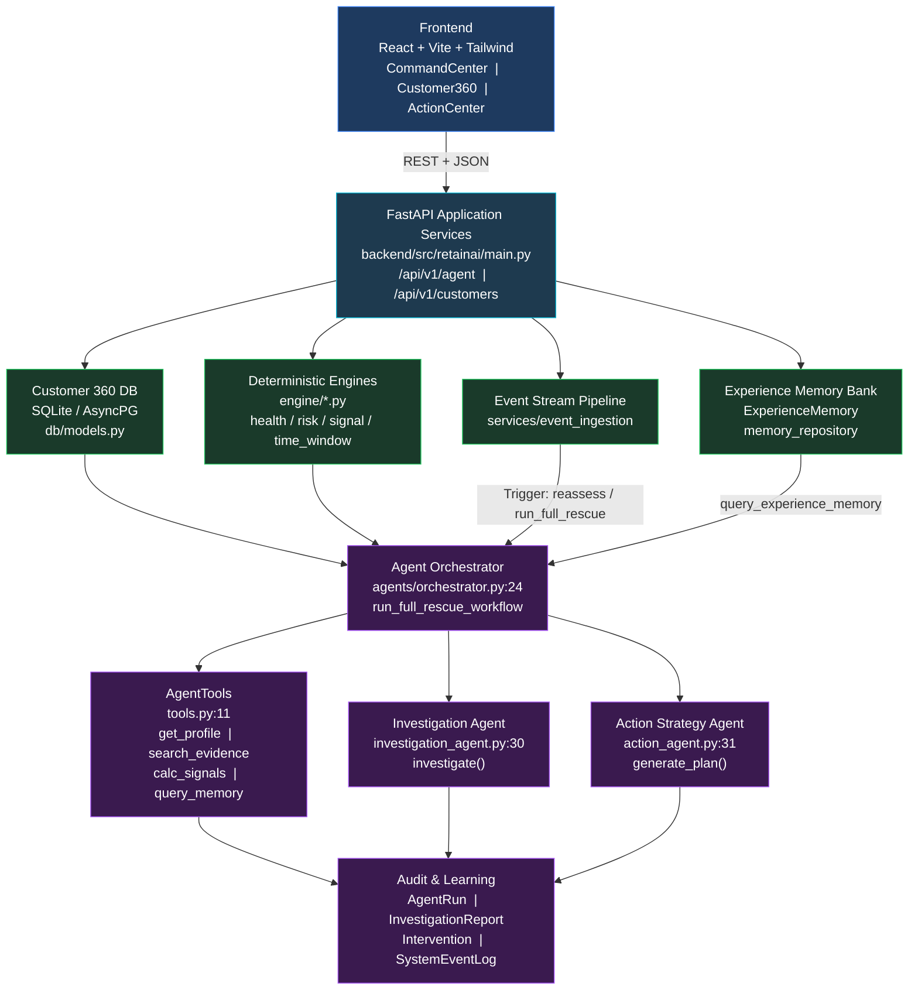
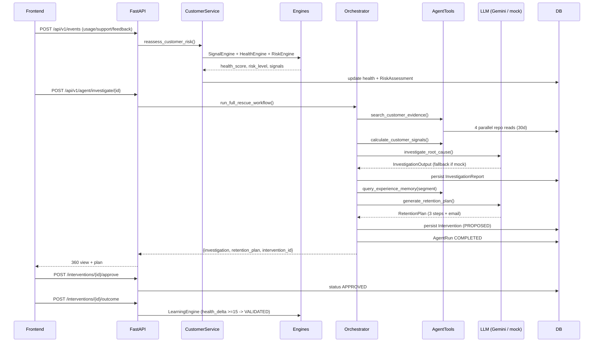

# RETAINAI -- Agent Architecture & Tool Specifications

> **Canonical Reference -- 5-Tool Contract (v2).** Replaces the stale 10-tool inventory. All file refs verified against `backend/src/retainai` as of `2026-08-30`.

---

## Table of Contents

1. [Philosophy -- Three Pillars](#1-philosophy--three-pillars)  |  2. [System Diagram](#2-system-diagram)  |  3. [Single Orchestrator](#3-single-orchestrator)  |  4. [LLM Client](#4-llm-client)  |  5. [Canonical 5-Tool Contracts](#5-canonical-5-tool-contracts)  |  6. [Implementation Mapping](#6-implementation-mapping)  |  7. [End-to-End Workflow](#7-end-to-end-workflow)  |  8. [Orchestrator Sequence](#8-orchestrator-sequence)  |  9. [Investigation Agent](#9-investigation-agent)  |  10. [Action Strategy Agent](#10-action-strategy-agent)  |  11. [Acme Replay](#11-acme-replay)  |  12. [Failure Handling](#12-failure-handling)  |  13. [HITL Guardrails](#13-hitl-guardrails)  |  14. [Audit Logging](#14-audit-logging)  |  15. [File Index](#15-file-index)

---

## 1. Philosophy -- Three Pillars

### Pillar 1 -- Single Orchestrator with Specialized Tools

- One coordinator owns the lifecycle: `backend/src/retainai/agents/orchestrator.py:24` (`class AgentOrchestrator`, 177 lines).
- Tools are deterministic Python, not autonomous sub-agents: `backend/src/retainai/agents/tools.py:11` (`class AgentTools`). Invoked sequentially by the orchestrator.
- Eliminates inter-agent chatter, reduces token cost, guarantees traceability, keeps failure surface to one `try/except` at `orchestrator.py:137-141`.

### Pillar 2 -- Deterministic Foundation + Agentic Reasoning

| Layer | Responsibility | Location |
| :--- | :--- | :--- |
| **Deterministic** | Math (period deltas, weighted health), threshold->risk, DB I/O, state transitions, ID generation | `engine/*`, `services/*`, `repositories/*` |
| **Agentic (LLM)** | Evidence synthesis, root-cause phrasing, communication drafting | `agents/investigation_agent.py:30`, `agents/action_agent.py:31` |

- `DetectedSignal` objects carry `impact_score`, `evidence_ids`, `delta_pct` (`engine/signal_engine.py:15-26`). No LLM touches thresholds.
- LLM agents interpret only what deterministic code surfaces. Sparse case (`health_score > 60` + `< 2` categories) short-circuits to `INSUFFICIENT_EVIDENCE` before any LLM call (`investigation_agent.py:65`).

### Pillar 3 -- Evidence-First Traceability

Every conclusion cites exact IDs (`usage_event_102`, `TICK-101`, `FEED-201`, `acme_usg_base_14`):

1. Collected from signals + tickets + feedback (`investigation_agent.py:46-54`), deduped via `set()`.
2. Stored on `InvestigationReport.evidence_ids` (`db/models.py:286`) and `RiskAssessment.evidence_ids`.
3. Returned in `run_full_rescue_workflow` payload for UI rendering.

> Invariant: `evidence_ids: List[str]` is required on every Pydantic output schema. Mock fallback populates it identically.

---

## 2. System Diagram



**Data flow:** `Telemetry ingestion -> signal/health/risk (deterministic) -> orchestrator gathers evidence -> LLM investigates -> LLM plans -> persist + audit -> HITL approval -> 14-day measure -> learning gate`.



---

## 3. Single Orchestrator

**File:** `backend/src/retainai/agents/orchestrator.py:24` (177 lines)

```python
class AgentOrchestrator:
    def __init__(self, session: AsyncSession):
        self.session = session
        self.tools = AgentTools(session)                  # agents/tools.py:11
        self.customer_service = CustomerService(session)  # services/customer_service.py:14
        self.investigation_agent = InvestigationAgent()   # agents/investigation_agent.py:30
        self.action_agent = ActionStrategyAgent()         # agents/action_agent.py:31
```

| Method | Signature | Purpose | Ref |
| :--- | :--- | :--- | :--- |
| `run_full_rescue_workflow` | `async (customer_id: str) -> Dict[str, Any]` | Canonical 8-step pipeline; creates `AgentRun`, persists reports & interventions, handles failure | `orchestrator.py:34` |
| `investigate_customer` | `async (customer_id: str) -> Any` | Backward-compat wrapper around `run_full_rescue_workflow`; fallback manual profile+reassess on failure | `orchestrator.py:144` |
| `plan_retention` | `async (customer_id: str, assessment: Any) -> RetentionPlanSchema` | Minimal fallback planner outside full workflow | `orchestrator.py:162` |

Sequential, no concurrency beyond the 4 telemetry reads inside `search_customer_evidence`.

---

## 4. LLM Client

**File:** `backend/src/retainai/agents/llm_client.py:15` (67 lines)

```python
class LLMClient:
    def __init__(self, api_key=None, model=None, provider=None):
        self.api_key  = api_key  or settings.LLM_API_KEY   # settings.py:33 mock_key_for_dev
        self.model    = model    or settings.LLM_MODEL     # gemini-2.5-flash
        self.provider = provider or settings.LLM_PROVIDER  # gemini
```

### `generate_structured_json` -- `llm_client.py:28`

```python
async def generate_structured_json(
    self, system_prompt: str, user_prompt: str,
    response_schema: Type[T],           # Pydantic BaseModel
    fallback_data: Dict[str, Any],
) -> T: ...
```

**Order (`llm_client.py:37-67`):**

1. **Mock gate (37):** `api_key in ("your_llm_api_key_here","mock_key_for_dev","")` -> `return response_schema.model_validate(fallback_data)` -- no HTTP. Default dev/demo path; reliability > novelty.
2. **Live call (42-53):** `provider == "gemini"` -> `POST https://generativelanguage.googleapis.com/v1beta/models/{model}:generateContent?key={api_key}` with `contents.parts.text = system+user+schema`, `generationConfig.responseMimeType="application/json"`, `timeout=10s` via `httpx.AsyncClient`.
3. **Parse (54-59):** Strip ```` ```json ```` fences, `json.loads`, `model_validate`. On 200 + valid JSON/schema -> return LLM result.
4. **Fallback (60-67):** Any non-200 / parse / validation / exception -> `model_validate(fallback_data)` -- caller never sees raw exception.

Secrets: defaults from `config/settings.py:33` (`pydantic-settings` + `.env`). Never logged or placed in prompt.

---

## 5. Canonical 5-Tool Contracts

| # | Canonical Tool | Parameters | Returns | Purpose |
| :-: | :--- | :--- | :--- | :--- |
| 1 | `search_customer_evidence` | `customer_id: str`, `days: int=30` | `Dict` `{ usage_events:[{id,date,dau,license_utilization}], support_tickets:[{id,severity,category,subject,status,description}], feedback_entries:[{id,source,sentiment,score,text}], account_events:[{id,event_type,description}] }` | Fan-out 4 telemetry repos in parallel; evidence base for reasoning |
| 2 | `calculate_customer_signals` | `customer_id: str` | `List[Dict]` `[{signal_type,category,severity,value,baseline,delta_pct,summary,evidence_ids,impact_score}]` | Deterministic period-over-period deltas via `SignalService` -> `SignalEngine`. No LLM |
| 3 | `investigate_root_cause` | `customer_name, health_score, risk_level, signals, usage_events, support_tickets, feedback_entries, account_events` | `InvestigationOutputSchema` `{summary,root_cause,confidence,uncertainty_status,evidence_ids,recommended_action_summary,missing_evidence}` | LLM forensic synthesis; cites exact IDs; sparse-data gate |
| 4 | `generate_retention_plan` | `customer_name, csm_name, investigation_summary, root_cause, matched_memories` | `RetentionPlanOutputSchema` `{action_type,title,description,objective,priority,plan_steps:[{step,title,owner,action,target_date}],draft_email:{recipient_role,subject,body},matched_memory_ids}` | LLM strategy; targets root cause; grounds in validated memories; empathetic email |
| 5 | `evaluate_outcome` | `intervention_id, health_before/after, usage_before/after, customer_response?` | `InterventionOutcome` `{status:SUCCESS/NEUTRAL/FAILURE,health_delta,confidence}` + optional `ExperienceMemory` | 14-day measurement; validation gate promotes `SUCCESS` to `VALIDATED` |

> Tool 5 is owned by `engine/learning_engine.py:25` (`LearningEngine.evaluate_intervention_outcome`), invoked via `demo/acme_replay.py:135` or outcome APIs.

---

## 6. Implementation Mapping

Physical codebase uses 4 `AgentTools` methods + 2 LLM agents (cleaner separation). Drift is intentional and documented.

| Canonical (#) | Physical | File & Line | Drift Note |
| :--- | :--- | :--- | :--- |
| `search_customer_evidence` (#1) | `AgentTools.search_customer_evidence(customer_id, days=30)` | `agents/tools.py:40` | 4 parallel `TelemetryRepository` calls; maps ORM -> dict. Supersedes stale `get_usage_history`/`get_support_history`/`get_customer_feedback`/`get_account_activity` split |
| `calculate_customer_signals` (#2) | `AgentTools.calculate_customer_signals(customer_id)` | `agents/tools.py:88` | Delegates to `SignalService.get_customer_signals` -> `SignalEngine.evaluate_all_signals`. Deterministic |
| `investigate_root_cause` (#3) | `InvestigationAgent.investigate(...)` | `agents/investigation_agent.py:34` | LLM-backed with evidence collection + sparse gate; calls `LLMClient.generate_structured_json`. Not in `AgentTools` |
| `generate_retention_plan` (#4) | `ActionStrategyAgent.generate_plan(...)` | `agents/action_agent.py:35` | LLM-backed; regex ticket ref; 3-step fallback + email. Not in `AgentTools` |
| `evaluate_outcome` (#5) | `LearningEngine.evaluate_intervention_outcome(...)` | `engine/learning_engine.py:25` | `health_delta = after-before`; `>=15->SUCCESS`, `>=0->NEUTRAL`, else `FAILURE`; on `SUCCESS` inserts validated memory |
| -- | `AgentTools.get_customer_profile(customer_id)` | `agents/tools.py:21` | Returns `{id,name,domain,segment,industry,mrr,arr,csm,csm_email,health_score,risk_level,is_false_positive_candidate}` or `{error}`. Convenience for prompt hydration; logged as `get_customer_profile` (`orchestrator.py:120`) |
| -- | `AgentTools.query_experience_memory(segment, risk_pattern)` | `agents/tools.py:91` | Calls `MemoryRepository.get_validated_memories(segment)` ordered `confidence DESC` (`repositories/memory_repository.py:19`). `risk_pattern` accepted but **not filtered** -- segment-only. Forward-compat param |

---

## 7. End-to-End Workflow

`AgentOrchestrator.run_full_rescue_workflow` (`agents/orchestrator.py:34`) -- Sense -> Think -> Act -> Measure -> Learn.

### Step 0 -- Initialize Audit Run

```python
# orchestrator.py:36-48
now = datetime.now(timezone.utc)
run_id = f"run_{customer_id[:5]}_{uuid.uuid4().hex[:6]}"
agent_run = AgentRun(id=run_id, customer_id=customer_id, started_at=now,
                     status=AgentRunStatus.RUNNING, workflow_type="CUSTOMER_RESCUE_INVESTIGATION")
self.session.add(agent_run)
await self.session.commit()
```

### Step 1 -- Profile & Deterministic Reassessment

```python
# orchestrator.py:52-55
reassessment = await self.customer_service.reassess_customer_risk(customer_id)
    # -> services/customer_service.py:27
    #   -> telemetry_repo.get_* (x4)
    #   -> SignalEngine.evaluate_all_signals (signal_engine.py:180)
    #   -> HealthEngine.compute_health_components (health_engine.py:22)
    #   -> RiskEngine.evaluate_risk (risk_engine.py:41)
    #   -> customer_repo.update_health_and_risk + risk_repo.create_assessment
profile  = await self.tools.get_customer_profile(customer_id)              # tools.py:21
evidence = await self.tools.search_customer_evidence(customer_id, days=30) # tools.py:40
signals  = await self.tools.calculate_customer_signals(customer_id)         # tools.py:88
```

Reassessment payload (source of truth for prompts):

```json
{
  "customer_id": "b2a88551-82e5-43d7-b620-ba1640900c71",
  "health_score": 38.0, "risk_level": "CRITICAL", "risk_score": 0.62,
  "confidence": 0.89,
  "signals": ["SEVERE_USAGE_DECLINE","UNRESOLVED_CRITICAL_SUPPORT_TICKET","NEGATIVE_CUSTOMER_FEEDBACK"],
  "health_components": {"usage": 60.0, "support": 65.0, "sentiment": 70.0, "engagement": 100.0},
  "is_insufficient_data": false, "evidence_ids": ["TICK-101","FEED-201","acme_usg_base_22"]
}
```

### Step 2 -- Forensic Investigation

```python
# orchestrator.py:58-67
investigation_res = await self.investigation_agent.investigate(
    customer_name=profile["name"], health_score=reassessment["health_score"],
    risk_level=reassessment["risk_level"], signals=signals,
    usage_events=evidence["usage_events"], support_tickets=evidence["support_tickets"],
    feedback_entries=evidence["feedback_entries"], account_events=evidence["account_events"])
# -> investigation_agent.py:34
```

### Step 3 -- Persist Report

```python
# orchestrator.py:70-85
investigation_id = f"inv_rep_{customer_id[:5]}_{uuid.uuid4().hex[:6]}"
inv_record = InvestigationReport(id=investigation_id, customer_id=customer_id,
    risk_assessment_id=f"risk_{customer_id[:5]}_{uuid.uuid4().hex[:6]}", created_at=now,
    summary=investigation_res.summary, root_cause=investigation_res.root_cause,
    confidence=investigation_res.confidence, uncertainty_status=investigation_res.uncertainty_status,
    evidence_ids=investigation_res.evidence_ids,
    recommended_action=investigation_res.recommended_action_summary,
    missing_evidence=investigation_res.missing_evidence)
self.session.add(inv_record)
await self.session.commit()
```

### Step 4 -- Memory Match + Action Plan

```python
# orchestrator.py:88-98
matched_memories = await self.tools.query_experience_memory(
    segment=profile["segment"], risk_pattern=investigation_res.root_cause)  # tools.py:91 -> memory_repository.py:19
plan_res = await self.action_agent.generate_plan(
    customer_name=profile["name"], csm_name=profile["csm"],
    investigation_summary=investigation_res.summary, root_cause=investigation_res.root_cause,
    matched_memories=matched_memories)  # -> action_agent.py:35
```

### Step 5 -- Persist Intervention

```python
# orchestrator.py:101-113
intervention_id = f"int_plan_{customer_id[:5]}_{uuid.uuid4().hex[:6]}"
intervention_record = Intervention(id=intervention_id, customer_id=customer_id,
    investigation_id=investigation_id, action_type=plan_res.action_type,
    title=plan_res.title, description=plan_res.description,
    plan=json.dumps(plan_res.plan_steps), status=InterventionStatus.PROPOSED, created_at=now)
self.session.add(intervention_record)
```

### Step 6 -- Complete Audit

```python
# orchestrator.py:116-125
agent_run.status = AgentRunStatus.COMPLETED
agent_run.completed_at = datetime.now(timezone.utc)
agent_run.input_summary  = f"Health Score {reassessment['health_score']:.1f} ({reassessment['risk_level']})"
agent_run.output_summary = f"Root cause: {investigation_res.root_cause}. Proposed intervention: {plan_res.title}"
agent_run.tool_calls = [
    {"tool": "get_customer_profile", "status": "success"},
    {"tool": "search_customer_evidence", "status": "success"},
    {"tool": "query_experience_memory", "status": "success"}]
await self.session.commit()
return {"run_id": run_id, "customer_id": customer_id,
        "health_dimensions": reassessment["health_components"],
        "risk_assessment": reassessment, "investigation": investigation_res.model_dump(),
        "retention_plan": plan_res.model_dump(), "intervention_id": intervention_id}
```

### Step 7 -- Exception Path

```python
# orchestrator.py:137-141
except Exception as e:
    agent_run.status = AgentRunStatus.FAILED
    agent_run.error = str(e)
    await self.session.commit()
    raise e
```

---

## 8. Orchestrator Sequence

```
Caller (API / Demo) ─► AgentOrchestrator.run_full_rescue_workflow(customer_id)  orchestrator.py:34
         ├─► AgentRun(RUNNING) ── commit
         ├─► CustomerService.reassess_customer_risk
         │     ├─► TelemetryRepository.get_* (x4)              repositories/telemetry_repository.py
         │     ├─► SignalEngine.evaluate_all_signals            engine/signal_engine.py:180
         │     ├─► HealthEngine.compute_health_components       engine/health_engine.py:22
         │     └─► RiskEngine.evaluate_risk                     engine/risk_engine.py:41
         ├─► AgentTools.get_customer_profile                    tools.py:21
         ├─► AgentTools.search_customer_evidence                tools.py:40
         ├─► AgentTools.calculate_customer_signals              tools.py:88
         ├─► InvestigationAgent.investigate                      investigation_agent.py:34
         │     └─► LLMClient.generate_structured_json            llm_client.py:28  (mock or Gemini POST)
         ├─► persist InvestigationReport                         db/models.py:275
         ├─► AgentTools.query_experience_memory                  tools.py:91
         ├─► ActionStrategyAgent.generate_plan                   action_agent.py:35
         ├─► persist Intervention (PROPOSED)                     db/models.py:297
         └─► AgentRun(COMPLETED) ─► return payload
              on exception: AgentRun(FAILED) + error + re-raise
```

---

## 9. Investigation Agent

**File:** `backend/src/retainai/agents/investigation_agent.py:9-123` (112 lines)

### Schema -- `InvestigationOutputSchema` (`investigation_agent.py:9`)

```python
class InvestigationOutputSchema(BaseModel):
    summary: str
    root_cause: str
    confidence: str = "HIGH_CONFIDENCE"  # HIGH_CONFIDENCE | MEDIUM | LOW | INSUFFICIENT_EVIDENCE
    uncertainty_status: str = "CLEAR"    # CLEAR | SPARSE_DATA
    evidence_ids: List[str] = Field(default_factory=list)
    recommended_action_summary: str
    missing_evidence: List[str] = Field(default_factory=list)
```

### System Prompt -- `investigation_agent.py:19-27`

```
You are RETAINAI Forensic Customer Success Investigation Agent.
Analyze multi-dimensional telemetry (usage, open tickets, feedback, admin events)
to determine exact root cause of churn risk.

RULES:
1. Every claim MUST cite exact evidence IDs from the input payload.
2. DO NOT fabricate evidence IDs or invent facts.
3. If < 2 telemetry categories present, return confidence='INSUFFICIENT_EVIDENCE' + missing_evidence.
4. Keep root cause concise, actionable (max 2 sentences).
```

### Execution -- `investigation_agent.py:34-123`

1. **Collect IDs (46-54):** from `signals[].evidence_ids` + `support_tickets[].id` + `feedback_entries[].id`, deduped.
2. **Sparse gate (57-75):** count non-empty among `usage_events/support_tickets/feedback_entries`. If `categories_present < 2 and health_score > 60` -> immediate `INSUFFICIENT_EVIDENCE`/`SPARSE_DATA` return, no LLM call.
3. **Fallback templates (78-106):**
   ```python
   ticket_str = f"Ticket '{ticket_id}: {ticket_subject}'"  # first OPEN/IN_PROGRESS
   feedback_str = f"Feedback '{comment[:80]}'"             # first NEGATIVE
   fallback_summary    = f"{name} health dropped to {score:.1f} ({level}) driven by {len(signals)} signals."
   fallback_root_cause = f"Feature export friction in {ticket_str} caused negative sentiment in {feedback_str}, leading to usage drop."
   fallback_action     = f"Escalate ticket {ticket_id} to Sprint Priority 1 and arrange onboarding sync with Head of Product."
   ```
   Wrapped with `confidence="HIGH_CONFIDENCE"`, `uncertainty_status="CLEAR"`.
4. **LLM delegate (108-123):** `user_prompt = json.dumps({customer_name, health_score, risk_level, signals, support_tickets, feedback_entries, usage_events[-5:]})` -> `LLMClient.generate_structured_json(SYSTEM_PROMPT, user_prompt, InvestigationOutputSchema, fallback.model_dump())`. Mock returns fallback directly.

### Fallback Example -- Acme Corp

```json
{
  "summary": "Acme Corp health dropped to 38.0 (CRITICAL) driven by 3 detected warning signals.",
  "root_cause": "Feature export friction in Ticket 'TICK-101: CSV Export fails for datasets > 10,000 rows' caused negative sentiment in Feedback 'Reporting export failure prevented our team from generating end-of-month executive decks.', leading to a drop in active usage.",
  "confidence": "HIGH_CONFIDENCE", "uncertainty_status": "CLEAR",
  "evidence_ids": ["TICK-101","FEED-201","acme_usg_base_20","acme_usg_base_21"],
  "recommended_action_summary": "Escalate ticket TICK-101 to Sprint Priority 1 and arrange technical onboarding sync with Head of Product.",
  "missing_evidence": []
}
```

---

## 10. Action Strategy Agent

**File:** `backend/src/retainai/agents/action_agent.py:9-103` (99 lines)

### Schema -- `RetentionPlanOutputSchema` (`action_agent.py:9`)

```python
class RetentionPlanOutputSchema(BaseModel):
    action_type: str; title: str; description: str; objective: str
    priority: str = "HIGH"  # HIGH | CRITICAL | NORMAL
    plan_steps: List[Dict[str, Any]] = Field(default_factory=list)
    draft_email: Dict[str, str] = Field(default_factory=dict)
    matched_memory_ids: List[str] = Field(default_factory=list)
```

### System Prompt -- `action_agent.py:20-28`

```
You are RETAINAI Action Strategy Agent.
Formulate personalized, actionable retention plan based on investigation + Experience Memories.
RULES:
1. Target root causes directly (bug -> escalation + check-in).
2. Reference validated Experience Memories if matching.
3. Provide step-by-step plan with owner and timeline.
4. Provide professional, empathetic email draft for CSM review.
```

### Execution -- `action_agent.py:35-103`

1. **Memory IDs (43):** `memory_ids = [m["id"] for m in matched_memories if "id" in m]`.
2. **Ticket ref (45-47):** regex `r"(TICK[-\s]?\w+|tck_\w+|[a-f0-9]{8}-[a-f0-9]{4})"` on `root_cause + summary`; else `"reported support ticket"`.
3. **Fallback steps (49-71):**
   ```python
   fallback_steps = [
     {"step":1,"title":"Engineering Escalation","owner":"Engineering Lead",
      "action":f"Escalate {ticket_ref} to Sprint Priority 1 patch release.","target_date":"Within 48 hours"},
     {"step":2,"title":"CSM Executive Outreach","owner":csm_name,
      "action":"Schedule 15-min sync with VP of Operations to review export patch.","target_date":"Day 3"},
     {"step":3,"title":"Product Onboarding Sync","owner":"Head of Product",
      "action":"Conduct 1-on-1 walkthrough for large dataset exports.","target_date":"Day 7"}]
   ```
4. **Fallback email (73-77):**
   ```python
   fallback_email = {
     "recipient_role":"Platform Administrator / Executive Lead",
     "subject":f"Priority Fix & Technical Sync -- {customer_name} Account Support",
     "body":f"Hi team,\n\nI wanted to personally reach out regarding {ticket_ref}. Our engineering team has escalated this to Sprint Priority 1 and dispatched a patch.\n\nCould we schedule a brief 10-min sync this week to confirm the fix meets your month-end reporting needs?\n\nBest regards,\n{csm_name}\nCustomer Success Lead"}
   ```
5. **LLM delegate (79-103):** `json.dumps({customer_name, csm_name, investigation_summary, root_cause, matched_memories})` -> `LLMClient.generate_structured_json(..., fallback.model_dump())`.

### Fallback Example -- Acme

```json
{
  "action_type": "ENGINEERING_ESCALATION_AND_EXECUTIVE_CHECKIN",
  "title": "Emergency Export Bug Patch & Executive Check-in for Acme Corp",
  "description": "Escalate report export bug to Sprint 1, schedule technical check-in, and conduct product walkthrough.",
  "objective": "Restore product trust, resolve critical support friction, and recover DAU metrics before renewal.",
  "priority": "CRITICAL",
  "plan_steps": [
    {"step":1,"title":"Engineering Escalation","owner":"Engineering Lead","action":"Escalate TICK-101 to Sprint Priority 1 patch release.","target_date":"Within 48 hours"},
    {"step":2,"title":"CSM Executive Outreach","owner":"Sarah Johnson","action":"Schedule 15-minute sync with VP of Operations to review export patch and report delivery.","target_date":"Day 3"},
    {"step":3,"title":"Product Onboarding Sync","owner":"Head of Product","action":"Conduct 1-on-1 technical walkthrough for large dataset exports.","target_date":"Day 7"}
  ],
  "draft_email": {
    "recipient_role":"Platform Administrator / Executive Lead",
    "subject":"Priority Fix & Technical Sync -- Acme Corp Account Support",
    "body":"Hi team,\n\nI wanted to personally reach out regarding the issue reported under TICK-101. Our engineering team has escalated this to Sprint Priority 1 and dispatched a patch.\n\nCould we schedule a brief 10-minute sync this week to confirm the fix meets your month-end reporting needs?\n\nBest regards,\nSarah Johnson\nCustomer Success Lead"
  },
  "matched_memory_ids": ["mem-001"]
}
```

---

## 11. Acme Replay

**File:** `backend/src/retainai/demo/acme_replay.py:13-149` (149 lines) -- deterministic demo harness for hero customer `b2a88551-82e5-43d7-b620-ba1640900c71`. No LLM dependence.

### `resolve_acme_id` -- `acme_replay.py:21`

```python
async def resolve_acme_id(self) -> str:
    if self._requested_id is not None: return self._requested_id
    try:
        result = await self.db.execute(select(Customer.id).where(Customer.name.ilike("%acme%")).limit(1))
        acme_id = result.scalars().first()
        if acme_id: return str(acme_id)
    except Exception: pass
    return "b2a88551-82e5-43d7-b620-ba1640900c71"
```

### Phase 1 -- Healthy Baseline -- `acme_replay.py:33-51`

```python
async def step_healthy_baseline(self) -> Dict[str, Any]:
    for i in range(25):
        ts = now - timedelta(days=30 - i)
        self.db.add(UsageEvent(id=f"acme_usg_base_{i}", customer_id=cid, timestamp=ts,
            daily_active_users=125 + (i % 5), license_utilization=0.88, feature_clicks=450, sessions=320))
    await self.db.commit()
    return await self.service.reassess_customer_risk(cid)  # health_score >= 80
```

### Phase 2 -- Inject Friction -- `acme_replay.py:53-103`

```python
async def step_inject_friction(self) -> Dict[str, Any]:
    await self.ingestion.ingest_event(cid, "SUPPORT_TICKET",
        {"id":"TICK-101","severity":"HIGH","category":"BUG","subject":"CSV Export fails for datasets > 10,000 rows",
         "description":"Export feature times out during month-end executive reporting.","status":"OPEN"}, now - timedelta(days=5))
    await self.ingestion.ingest_event(cid, "CUSTOMER_FEEDBACK",
        {"id":"FEED-201","source":"CSAT_SURVEY","sentiment":"NEGATIVE","sentiment_score":-0.85,"score":2,
         "text":"Reporting export failure prevented our team from generating end-of-month executive decks."}, now - timedelta(days=3))
    for i in range(5):
        await self.ingestion.ingest_event(cid, "USAGE_EVENT",
            {"daily_active_users":42,"license_utilization":0.32,"feature_clicks":80,"sessions":50}, now - timedelta(days=5 - i))
    return await self.service.reassess_customer_risk(cid)  # health < 70, often 38-45
```

### Phase 3 -- Recovery -- `acme_replay.py:105-149`

```python
async def step_post_intervention_recovery(self, intervention_id: str) -> Dict[str, Any]:
    for i in range(7):
        await self.ingestion.ingest_event(cid, "USAGE_EVENT",
            {"daily_active_users":118+(i%3),"license_utilization":0.86,"feature_clicks":420,"sessions":300}, now + timedelta(days=i+1))
    ticket_res = await self.db.get(SupportTicket, "TICK-101")
    if ticket_res: ticket_res.status="RESOLVED"; ticket_res.resolved_at=now; await self.db.commit()
    reassessment = await self.service.reassess_customer_risk(cid)
    outcome = await self.learning.evaluate_intervention_outcome(
        intervention_id=intervention_id, health_before=38.0, health_after=reassessment["health_score"],
        usage_before=42.0, usage_after=118.0,
        customer_response="Engineering patch deployed. Acme team confirmed CSV export fix.",
        notes="Successful rescue story completed.")
    return {"reassessment": reassessment, "outcome_status": outcome.status.value, "health_delta": outcome.health_delta}
    # Expected: health > 70, SUCCESS, health_delta > 15
```

Demo: `POST /api/v1/agent/demo/replay_acme_step?step=healthy|friction|recovery&intervention_id=...` (`api/agent_routes.py:60`).

---

## 12. Failure Handling

### LLM -> Deterministic Fallback

| Layer | Fallback | Ref |
| :--- | :--- | :--- |
| `LLMClient` | Mock gate or any HTTP/parse/validation exception -> `model_validate(fallback_data)` | `llm_client.py:37-67` |
| `InvestigationAgent` | Sparse gate -> `INSUFFICIENT_EVIDENCE` before LLM; else ticket+feedback templates | `investigation_agent.py:65-106` |
| `ActionStrategyAgent` | Regex ticket + 3-step plan + email template | `action_agent.py:49-88` |
| `Orchestrator` main | `try/except` -> `AgentRun.FAILED` + `error` + re-raise | `orchestrator.py:137-141` |
| `investigate_customer` | Any exception -> manual `reassess_customer_risk` + dict or `{error:"Customer not found"}` | `orchestrator.py:144-160` |
| `plan_retention` | Static single-step check-in, priority `CRITICAL`/`NORMAL` by `risk_level` | `orchestrator.py:162-177` |

### Validation & Not-Found

```python
# tools.py:21-24
customer = await self.customer_repo.get_by_id(customer_id)
if not customer: return {"error": f"Customer {customer_id} not found."}
# services/customer_service.py:28 -> raise ValueError -> HTTP 404
# engine/risk_engine.py:48 -- total_data_points < 3 -> WATCH / 0.40 / is_insufficient_data
# engine/time_window.py:44 -- avg_baseline < 1.0 -> pct_delta 0.0/100.0 (divide-by-zero guard)
```

### Timeout

`httpx.AsyncClient(timeout=10.0)` at `llm_client.py:52` -- prevents hung Gemini from blocking orchestrator. Gemini key passed as query param over HTTPS; not logged.

---

## 13. HITL Guardrails

No intervention executes without explicit CSM approval. Agent **proposes**, human **approves**.

### Status Machine -- `db/models.py:35-44`

```
PROPOSED -> RECOMMENDED -> APPROVED -> IN_PROGRESS -> EXECUTED -> COMPLETED
   │           │            │
   └─►REJECTED └─►REJECTED  └─►CANCELLED
```

- Orchestrator creates with `status=InterventionStatus.PROPOSED` (`orchestrator.py:110`). External actions gated on `status == APPROVED`.
- `SystemEventLog` + `AgentRun` audit every HITL decision.

| Tier | Tools | Gate | Ref |
| :--- | :--- | :--- | :--- |
| **Safe Read (auto)** | `get_customer_profile`, `search_customer_evidence`, `calculate_customer_signals`, `query_experience_memory` | None -- read-only | `agents/tools.py` |
| **Action (HITL)** | Email, meeting, account change, status transition | `Intervention.status == APPROVED` + `approved_by` | `db/models.py:307-311` |

- Not gated: investigation, scoring, memory lookup, draft generation, outcome eval.
- Gated: any mutation contacting customer externally. Demo email in `action_agent.py:73` remains `draft_email` -- never auto-sent.

---

## 14. Audit Logging

### AgentRun -- `db/models.py:374-392`

```python
class AgentRun(Base):
    __tablename__ = "agent_runs"
    id: Mapped[str]               # run_{cust[:5]}_{uuid6}          orchestrator.py:37
    customer_id: Mapped[str]
    started_at: Mapped[datetime]  # UTC                             orchestrator.py:36,40
    completed_at: Mapped[Optional[datetime]]
    status: Mapped[AgentRunStatus]# RUNNING|COMPLETED|FAILED|FALLBACK models.py:62
    workflow_type: Mapped[str]    # "CUSTOMER_RESCUE_INVESTIGATION"   orchestrator.py:45
    model: Mapped[str]            # "gemini-2.5-flash"
    input_summary: Mapped[str]    # f"Health Score {score:.1f} ({level})"  orchestrator.py:118
    output_summary: Mapped[str]   # f"Root cause: {root}. Proposed: {title}" :119
    tool_calls: Mapped[List[Dict]]# [{"tool":"get_customer_profile","status":"success"},...] :120-124
    error: Mapped[Optional[str]]  # only on FAILED                  orchestrator.py:139
```

Lifecycle: `RUNNING` at `orchestrator.py:40` -> `COMPLETED` (with `completed_at`, summaries, `tool_calls`) at `:116` or `FAILED` (`:138`) + re-raise. Query: `GET /api/v1/agent/runs/{customer_id}` (`api/agent_routes.py:38`).

### SystemEventLog -- `db/models.py:394-404`

```python
class SystemEventLog(Base):
    __tablename__ = "system_event_logs"
    id, timestamp, customer_id, event_type, description, details: Dict[str, Any]
```

Written by ingestion/learning layers; with `InvestigationReport` (`models.py:275`) and `Intervention`/`InterventionOutcome` (`models.py:297-346`) forms chain `RiskAssessment -> InvestigationReport -> Intervention -> Outcome -> ExperienceMemory`.

---

## 15. File Index

| Component | File | Lines | Symbol |
| :--- | :--- | :--- | :--- |
| Orchestrator | `agents/orchestrator.py` | 177 | `AgentOrchestrator` |
| LLM Client | `agents/llm_client.py` | 67 | `LLMClient`, `generate_structured_json` |
| Agent Tools | `agents/tools.py` | 104 | `AgentTools` |
| Investigation Agent | `agents/investigation_agent.py` | 112 | `InvestigationAgent`, `InvestigationOutputSchema` |
| Action Strategy Agent | `agents/action_agent.py` | 99 | `ActionStrategyAgent`, `RetentionPlanOutputSchema` |
| Acme Replay | `demo/acme_replay.py` | 149 | `AcmeReplayEngine` |
| Health / Signal / Risk / TimeWindow / Learning | `engine/health_engine.py` (61), `signal_engine.py` (219), `risk_engine.py` (79), `time_window.py` (107), `learning_engine.py` (141) | -- | `HealthEngine`, `SignalEngine`, `RiskEngine`, `LearningEngine` |
| Config / DB / Services | `config/settings.py` (59), `db/models.py` (404), `services/customer_service.py` (77) | -- | `Settings`, `AgentRun`, `reassess_customer_risk` |
| Repositories & Seed | `repositories/telemetry_repository.py` (~122), `memory_repository.py` (29), `scripts/seed_database.py` (222) | -- | `TelemetryRepository`, `seed_demo_data()` |
| API Routes | `api/agent_routes.py` | ~70 | `router`, `run_full_rescue_workflow` |

> Maintenance: Keep §5 (canonical contracts) and §6 (physical mapping) in sync per PR. Do not revive the legacy 10-tool split -- evidence reads are consolidated under `search_customer_evidence` for sequential auditability.


