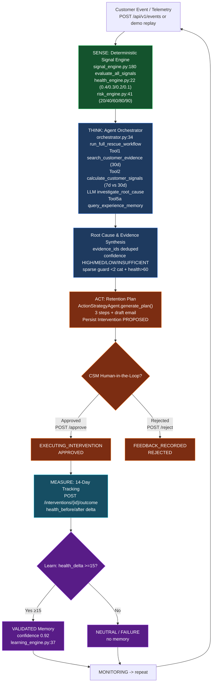
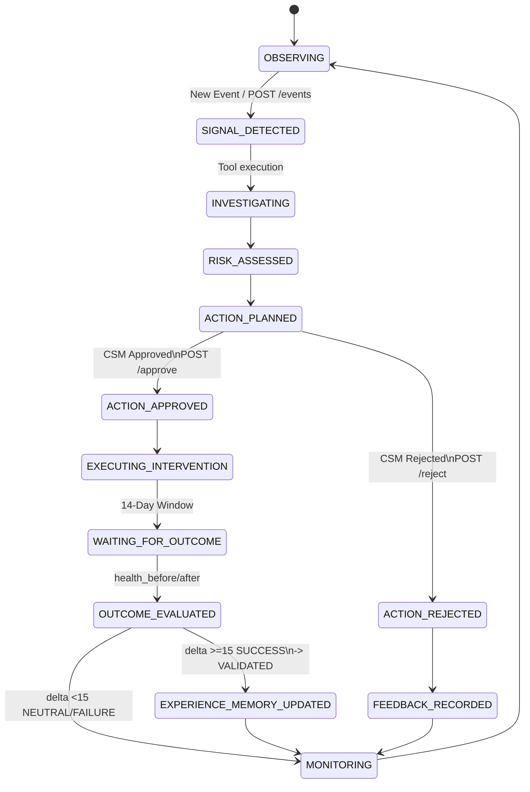

# RETAINAI -- System & Agent Architecture

> **Canonical decisions locked:** `docs/IMPLEMENTATION_PLAN.md:19` -- when any doc conflicts, that table wins.

## Architectural Principles

1. **Deterministic Foundation, Agentic Reasoning:** Math, percentage deltas (`backend/src/retainai/engine/time_window.py:23`), database constraints, state transitions, and tool validation are handled in strict deterministic Python code. Evidence synthesis, investigation, root-cause reasoning, and communication crafting are performed by LLM agents (`backend/src/retainai/agents/investigation_agent.py:19`).

2. **Single Orchestrator with Modular Tools:** Rather than fragmented, noisy multi-agent communication, RETAINAI uses a central Agent Orchestrator (`backend/src/retainai/agents/orchestrator.py:24`) equipped with clean, schema-validated, single-responsibility tools (`backend/src/retainai/agents/tools.py:11`).

3. **Evidence-First Traceability:** Every conclusion produced by the agent includes explicit references to underlying telemetry record IDs (`usage_event_102`, `support_ticket_405`, `feedback_12`) -- enforced in `investigation_agent.py:46` and validated via `evidence_ids` in `backend/src/retainai/db/models.py:286`.

---

## System Component Diagram

```mermaid
flowchart TB
    FE["Frontend<br/>React + Vite + Tailwind<br/>CommandCenter  |  Customer360  |  ActionCenter"]
    API["FastAPI Application Services<br/>api/routes.py (18) + api/agent_routes.py (4)<br/>main.py:13 lifespan init_db()"]
    DB["Customer 360 DB<br/>SQLite / AsyncPG<br/>db/session.py<br/>db/models.py (404)"]
    ENG["Deterministic Engines<br/>engine/*<br/>health 0.4/0.3/0.2/0.1  |  risk 20/40/60/80/90<br/>signal 7 types"]
    PIPE["Event Stream Pipeline<br/>services/event_ingestion_service.py"]
    ORCH["Agent Orchestrator<br/>agents/orchestrator.py<br/>run_full_rescue_workflow()"]
    TOOL1["Customer 360 Data Tools<br/>get_customer_profile<br/>search_customer_evidence"]
    TOOL2["Risk & Root Cause Tools<br/>investigate_root_cause<br/>generate_retention_plan"]
    TOOL3["Experience Memory Engine<br/>query_experience_memory<br/>evaluate_outcome"]
    HITL["HITL Approval Gate<br/>PROPOSED -> APPROVED<br/>-> EXECUTED -> MEASURE<br/>-> VALIDATED"]

    FE -->|REST axios /api/v1| API
    API --> DB
    API --> ENG
    API --> PIPE
    DB --> ORCH
    ENG --> ORCH
    PIPE -->|Trigger Event<br/>POST /events| ORCH
    ORCH -->|Tool Calls (4) + LLM fallback| TOOL1
    ORCH --> TOOL2
    ORCH --> TOOL3
    TOOL1 --> HITL
    TOOL2 --> HITL
    TOOL3 --> HITL

    classDef fe fill:#1e3a5f,stroke:#3b82f6,color:#fff
    classDef api fill:#164e63,stroke:#06b6d4,color:#fff
    classDef data fill:#14532d,stroke:#22c55e,color:#fff
    classDef agent fill:#581c87,stroke:#a855f7,color:#fff
    classDef gate fill:#7c2d12,stroke:#f97316,color:#fff
    class FE fe
    class API api
    class DB,ENG,PIPE data
    class ORCH,TOOL1,TOOL2,TOOL3 agent
    class HITL gate
```

<details>
<summary>Text fallback (for offline readers)</summary>

```text
Frontend (React + Vite + Tailwind) -> REST -> FastAPI -> {Customer 360 DB + Deterministic Engines + Event Pipeline} -> Trigger -> Agent Orchestrator -> {Data Tools + Risk Tools + Memory Engine} -> HITL Gate
```
</details>

**Monorepo:** `backend/src/retainai/` (FastAPI), `frontend/src/` (React 18 + Vite + Tailwind), `data/seed/retainai_dataset_v2.json` (101 customers), `docker-compose.yml` (backend:8000 + frontend:5173 + postgres:16-alpine).

---

## Core Agent Tools -- Canonical 5-Step Contracts

> **Authoritative source:** `docs/ai/tool-contracts.md` -- the 5-step set below is canonical. The 10-tool naming seen in legacy `AGENT_ARCHITECTURE.md` is retained as an alias only (see Implementation Note). Actual runtime wiring is via `agents/tools.py:11` (4 deterministic tools) + `investigation_agent.py` + `action_agent.py` + `learning_engine.py`.

| # | Canonical Tool | Actual Method | Parameters | Output Schema | Purpose |
|---|---|---|---|---|---|
| 1 | `search_customer_evidence` | `AgentTools.search_customer_evidence` `tools.py:40` | `customer_id: str, days: int=30` | `{usage_events, support_tickets, feedback_entries, account_events}` | Parallel telemetry fetch (4 repos) for 360 evidence |
| 2 | `calculate_customer_signals` | `AgentTools.calculate_customer_signals` `tools.py:88` -> `SignalService` -> `SignalEngine.evaluate_all_signals` | `customer_id: str` | `List[DetectedSignal dict]` `impact_score` etc | Deterministic period-over-period deltas (7d vs 30d) + 7 signal types |
| 3 | `investigate_root_cause` | `InvestigationAgent.investigate` `investigation_agent.py:34` | `customer_name, health_score, risk_level, signals, usage_events, support_tickets, feedback_entries, account_events` | `InvestigationOutputSchema` `summary, root_cause, confidence HIGH/MED/LOW/INSUFFICIENT, evidence_ids, recommended_action_summary` | Evidence-grounded RCA synthesis (LLM with deterministic fallback) |
| 4 | `generate_retention_plan` | `ActionStrategyAgent.generate_plan` `action_agent.py:35` | `customer_name, csm_name, investigation_summary, root_cause, matched_memories` | `RetentionPlanOutputSchema` `action_type, title, plan_steps[3], draft_email, matched_memory_ids` | Personalized 3-step intervention + email grounded in memory |
| 5 | `evaluate_outcome` | `LearningEngine.evaluate_intervention_outcome` `learning_engine.py:25` | `intervention_id, health_before, health_after, usage_before, usage_after, customer_response, notes` | `InterventionOutcome` `status SUCCESS(>=15)/NEUTRAL(>=0)/FAILURE, health_delta` + optional `ExperienceMemory VALIDATED` | 14-day window outcome validation + global learning update |

### Legacy 10-Tool Alias Map (for reference only)

| Legacy name | Canonical target | Status |
|---|---|---|
| `get_customer_profile` | Step 1 (subset) | Alias -- still callable via `tools.py:21` |
| `get_usage_history` | Step 1 | Alias |
| `get_support_tickets` / `get_support_history` | Step 1 | Alias |
| `get_customer_feedback` | Step 1 | Alias |
| `get_account_activity` | Step 1 | Alias |
| `calculate_signals` | Step 2 | Alias |
| `get_previous_interventions` | Step 4 memory input | Alias |
| `query_experience_memory` | Step 4 | Direct `tools.py:91` |
| `generate_retention_plan` | Step 4 | Direct |
| `record_intervention` / `record_outcome` | Step 5 | Direct `routes.py:119,146` |

Do not add new tools without updating `docs/ai/tool-contracts.md` and `agents/tools.py`.

---

## Agent Execution Workflow (Sense -> Think -> Act -> Measure -> Learn)



<details>
<summary>Text fallback</summary>

```text
[Event] -> SENSE (Signal/Health/Risk) -> THINK (Tools + LLM + Memory) -> ACT (Plan PROPOSED) -> HITL (APPROVED/REJECTED) -> MEASURE (14d outcome) -> LEARN (≥15 VALIDATED) -> MONITORING -> loop
```
</details>

Persisted audit: `AgentRun` `db/models.py:374` per workflow run (`RUNNING->COMPLETED/FAILED`), `InvestigationReport` `db/models.py:241`, `Intervention` `db/models.py:263`, `InterventionOutcome` `db/models.py:286`.

---

## Agent State Machine (Detailed)



<details>
<summary>Text fallback</summary>

```text
OBSERVING -> SIGNAL_DETECTED -> INVESTIGATING -> RISK_ASSESSED -> ACTION_PLANNED -> {APPROVED->EXECUTING->WAITING(14d)->EVALUATED->MEMORY_UPDATED | REJECTED->FEEDBACK} -> MONITORING -> OBSERVING
```
</details>

Intervention row states: `PROPOSED -> RECOMMENDED -> APPROVED -> IN_PROGRESS -> EXECUTED -> COMPLETED` (plus `REJECTED/CANCELLED`) `db/models.py:35`.

---

## Data Schema Entities (Authoritative)

Canonical in `backend/src/retainai/db/models.py:57` (14 tables) and `docs/DATA_MODEL.md`:

- **`customers`**: id, name, domain, segment, industry, plan, mrr, arr, csm_name/email, start_date, renewal_date, status, health_score, risk_level, is_false_positive_candidate.
- **`usage_events`**: id, customer_id, timestamp, daily_active_users, wau, mau, license_utilization, job_completion_rate, feature_clicks, sessions.
- **`support_tickets`**: id, customer_id, created_at, resolved_at, severity, category, status, csat, subject, description.
- **`customer_feedbacks`**: id, customer_id, created_at, source, score, sentiment, sentiment_score, text, category.
- **`account_events`**: id, customer_id, timestamp, event_type, description, metadata_json.
- **`risk_assessments`**: id, customer_id, created_at, health_score, risk_level, usage/support/sentiment/engagement_health, detected_signals, confidence.
- **`evidences`**: id, customer_id, source_type, source_id, timestamp, summary, importance.
- **`investigation_reports`**: id, customer_id, risk_assessment_id, summary, root_cause, confidence, evidence_ids, recommended_action, missing_evidence.
- **`interventions`**: id, customer_id, investigation_id, action_type, title, description, plan, status, approved_by.
- **`intervention_outcomes`**: id, intervention_id, customer_id, health_before/after/delta, usage_before/after, status, evaluation_status.
- **`experience_memories`**: id, context_pattern, customer_segment, risk_pattern, signals, recommended_strategy, actual_action, observed_outcome, confidence, validation_status, success_count.
- **`agent_runs`**: id, customer_id, started_at, completed_at, status, workflow_type, model, input_summary, output_summary, tool_calls.
- **`system_event_logs`**: id, timestamp, customer_id, event_type, description, details.
- **`feature_adoptions`**: id, customer_id, feature_name, period_start/end, adoption_rate.

Detail: `docs/DATA_MODEL.md` (688 lines) and `docs/BACKEND_GUIDE.md:5` (enums 6/8/7/3/4).

---

## Implementation Notes

- **Fallback determinism:** Every `LLMClient.generate_structured_json` call has a hardcoded fallback path that triggers when `LLM_API_KEY` is `mock_key_for_dev` or empty (`agents/llm_client.py:37`). This makes the demo reliable without network.
- **Guardrails:** Unknown `event_type` still logs + reassesses (no telemetry row) `services/event_ingestion_service.py:80`; insufficient data `<3` points returns `WATCH/0.30/0.40 INSUFFICIENT_DATA_BASELINE` `engine/risk_engine.py:48`; health dims ignore `USAGE_CONTEXT` category (see `docs/ENGINE_REFERENCE.md` safeguard note).
- **Orphaned routes:** `api/agent.py`, `api/customers.py`, `api/experience.py` are NOT mounted in `main.py:35` -- only `api/routes.py` + `api/agent_routes.py` are active (see `docs/API_REFERENCE.md` orphaned warning).
- **Health model canonical:** 4-dim `0.4/0.3/0.2/0.1`; the 6-dim `PRODUCT.md:4` listing is roadmap, not MVP (`docs/IMPLEMENTATION_PLAN.md:23`).

