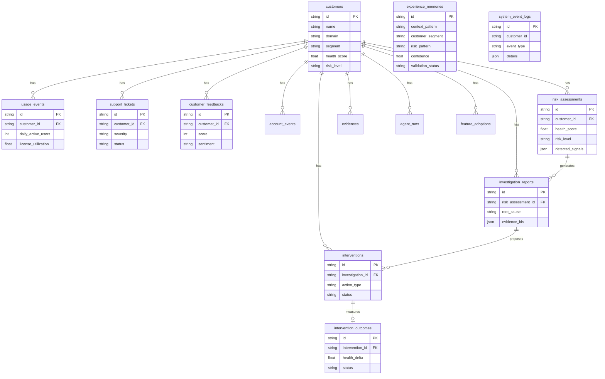

# RETAINAI -- Data Model Specification (Authoritative)

> **Source file:** `backend/src/retainai/db/models.py` (404 lines, 2026-08-30 snapshot).
> This document is generated from the ORM definitions -- **it is the canonical reference**.
> The stale 6-dimension / `health_records` / `customer_users` draft previously in this file has
> been retired. See canonical decisions below and `docs/ENGINE_REFERENCE.md` §2.
>
> Conventions: `Type(Mapped)` = SQLAlchemy 2.0 `mapped_column` type. `Default` = Python-side
> default (applied before `commit`). `Index` = entries from `__table_args__`. `FK` = foreign key.

Canonical decisions the docs must not drift from:

* **4-dim health** (not 6): `usage_health / support_health / sentiment_health / engagement_health`
  on `RiskAssessment`, not a standalone `health_records` table.
* **6 risk levels**: `HEALTHY / STABLE / WATCH / AT_RISK / HIGH_RISK / CRITICAL` -- `db/models.py:14`.
* **Acme hero**: `b2a88551-82e5-43d7-b620-ba1640900c71` (`acmecorp.com`, Enterprise, MRR 12000, health 88) -- dataset-v2.

---

## 1. ERD -- Mermaid



<details>
<summary>Text fallback (offline)</summary>

```
                    Customer (customers) 1─* {UsageEvent, SupportTicket, Feedback, AccountEvent, RiskAssessment, Evidence, InvestigationReport, Intervention, AgentRun, FeatureAdoption}
                    RiskAssessment 1─* InvestigationReport 1─* Intervention 1─1 InterventionOutcome
                    Independent: ExperienceMemory (global, segment-filtered), SystemEventLog (string FK)
```
</details>

**Relationship cardinalities (from ORM `relationship` declarations at `db/models.py:77`):**

* `Customer` 1 ── * `UsageEvent`, `FeatureAdoption`, `SupportTicket`, `CustomerFeedback`,
  `AccountEvent`, `RiskAssessment`, `Evidence`, `InvestigationReport`, `Intervention`, `AgentRun`
* `RiskAssessment` 1 ── * `InvestigationReport`
* `InvestigationReport` 1 ── * `Intervention`
* `Intervention` 1 ── 0..1 `InterventionOutcome`
* `ExperienceMemory` and `SystemEventLog` have no direct FK relationship to `Customer` traversal
  (memory is segment-filtered, event log by string customer id).

---

## 2. Enums

**File:** `backend/src/retainai/db/models.py:10`

### 2.1 RiskLevel -- `str` Enum, 6 values

```python
class RiskLevel(str, Enum):
    HEALTHY    = "HEALTHY"
    STABLE     = "STABLE"
    WATCH      = "WATCH"
    AT_RISK    = "AT_RISK"
    HIGH_RISK  = "HIGH_RISK"
    CRITICAL   = "CRITICAL"
```

Stored as `SQLEnum(RiskLevel)` on `Customer.risk_level` and `RiskAssessment.risk_level`.
Threshold mapping in `engine/risk_engine.py:18` (see `ENGINE_REFERENCE.md` §3).

### 2.2 InterventionStatus -- `str` Enum, 8 values

```python
class InterventionStatus(str, Enum):
    PROPOSED    = "PROPOSED"      # default on Intervention.status
    RECOMMENDED = "RECOMMENDED"
    APPROVED    = "APPROVED"
    REJECTED    = "REJECTED"
    IN_PROGRESS = "IN_PROGRESS"
    EXECUTED    = "EXECUTED"
    COMPLETED   = "COMPLETED"
    CANCELLED   = "CANCELLED"
```

### 2.3 OutcomeStatus -- `str` Enum, 7 values

```python
class OutcomeStatus(str, Enum):
    PENDING       = "PENDING"       # default on InterventionOutcome.status
    POSITIVE      = "POSITIVE"
    SUCCESS       = "SUCCESS"
    NEUTRAL       = "NEUTRAL"
    NEGATIVE      = "NEGATIVE"
    FAILURE       = "FAILURE"
    INCONCLUSIVE  = "INCONCLUSIVE"
```

Used for both `InterventionOutcome.status` and `InterventionOutcome.evaluation_status`
(`db/models.py:292`).

### 2.4 ValidationStatus -- `str` Enum, 3 values

```python
class ValidationStatus(str, Enum):
    CANDIDATE = "CANDIDATE"   # default on ExperienceMemory
    VALIDATED = "VALIDATED"
    REJECTED  = "REJECTED"
```

Only `VALIDATED` memories are served by `MemoryRepository.get_validated_memories`.

### 2.5 AgentRunStatus -- `str` Enum, 4 values

```python
class AgentRunStatus(str, Enum):
    RUNNING   = "RUNNING"    # default on AgentRun
    COMPLETED = "COMPLETED"
    FAILED    = "FAILED"
    FALLBACK  = "FALLBACK"
```

All enums inherit `str` so SQLite stores them as text and Pydantic serializes them as plain strings.
Postgres via `asyncpg` can map `SQLEnum` to a native PG enum if a migration is created -- current
`Base.metadata.create_all` does not create PG enum types explicitly, so values are free-text there too.

---

## 3. Tables -- Column Reference

Each table's `Default` is the Python-side `mapped_column(default=...)` or `default=lambda: now(UTC)`.
`Nullable` reflects the ORM `nullable=` argument, not DB NOT NULL from `create_all` variance.

### 3.1 `customers` -- `Customer` at `db/models.py:57`

Primary identity. Deterministically seeded from `data/seed/retainai_dataset_v2.json`.

| Column | Type | Default | Nullable | Notes |
|---|---|---|---|---|
| `id` | `String(50)` PK | -- | NO | UUID v4 string; Acme hero = `b2a88551-82e5-43d7-b620-ba1640900c71` |
| `external_id` | `String(100)` | `None` | YES | Aliased from dataset; synthesized as `ext-{id[:8]}` if absent |
| `name` | `String(100)` | -- | NO | Company name; ordered by in `list_all()` |
| `domain` | `String(100)` | -- | NO | Primary domain; from `website` or slug fallback |
| `segment` | `String(50)` | `"Enterprise"` | NO | `tier` alias; values `Enterprise / Mid-Market / SMB` |
| `industry` | `String(50)` | `"Software"` | NO | Vertical |
| `plan` | `String(50)` | `"Enterprise Tier"` | NO | `{tier} Tier` |
| `mrr` | `Float` | `0.0` | NO | Monthly recurring revenue (USD) |
| `arr` | `Float` | `0.0` | NO | `mrr*12` if absent in dataset |
| `csm_name` | `String(100)` | -- | NO | Assigned CSM; Acme = `Sarah Johnson` |
| `csm_email` | `String(100)` | `"csm@retainai.io"` | NO | Derived from `csm_name` slug if absent |
| `start_date` | `Date` | `date.today()` | NO | Contract start (from dataset `created_at` date part) |
| `renewal_date` | `Date` | -- | NO | Required; `date.today()+365` fallback |
| `status` | `String(50)` | `"ACTIVE"` | NO | `ACTIVE` / `CHURNED` etc. -- not an enum |
| `health_score` | `Float` | `100.0` | NO | Overwritten by `reassess_customer_risk`, rounded to 1 decimal on write |
| `risk_level` | `SQLEnum(RiskLevel)` | `HEALTHY` | NO | Overwritten alongside health |
| `is_false_positive_candidate` | `Boolean` | `False` | NO | `True` for `archetype==FALSE_POSITIVE` -- drives `FALSE_POSITIVE_SAFEGUARD` |
| `created_at` | `DateTime` | `now(UTC)` | NO | Dataset `created_at` or `now` fallback |
| `updated_at` | `DateTime` | `now(UTC)` on insert, `now(UTC)` on update via `onupdate` | NO | Auto-touched on any `UPDATE` |

**Indices (`__table_args__` at `models.py:85`):**

* `idx_customers_risk(risk_level)` -- supports `list_by_risk`
* `idx_customers_health(health_score)`
* `idx_customers_status(status)`

**Relationships (back_populates at `models.py:79`):**

`usage_events`, `feature_adoptions`, `support_tickets`, `feedback_entries`, `account_events`,
`risk_assessments`, `evidences`, `investigation_reports`, `interventions`, `agent_runs`
all with `cascade="all, delete-orphan"`.

---

### 3.2 `usage_events` -- `UsageEvent` at `db/models.py:95`

Daily usage snapshots. Dataset count: **3131** rows (101 customers, ~30d each).

| Column | Type | Default | Nullable | Notes |
|---|---|---|---|---|
| `id` | `String(50)` PK | -- | NO | Dataset `id` |
| `customer_id` | `String(50)` FK->`customers.id` | -- | NO | Part of composite index |
| `timestamp` | `DateTime` | -- | NO | Required; ISO from dataset `timestamp` |
| `daily_active_users` | `Integer` | `0` | NO | `dau` alias; `DAU` for window engine |
| `active_users` | `Integer` | `0` | NO | Duplicated `dau` for fallback in `_get_dau` |
| `wau` | `Integer` | `0` | NO | `dau*5` if absent |
| `mau` | `Integer` | `0` | NO | `dau*20` if absent |
| `total_sessions` | `Integer` | `0` | NO | `feature_clicks + export_events` |
| `license_utilization` | `Float` | `0.0` | NO | `license_utilization_pct` alias; fraction 0..1 |
| `job_completion_rate` | `Float` | `1.0` | NO | **Stored but not consumed by any engine today** |
| `feature_clicks` | `Integer` | `0` | NO | `core_feature_clicks` alias |
| `sessions` | `Integer` | `0` | NO | `admin_logins + export_events` if absent |
| `usage_minutes` | `Float` | `0.0` | NO | `dau*15.0` if absent |
| `feature_adoption_rates` | `JSON` | `{}` | NO | Per-feature adoption dict |
| `event_type` | `String(50)` | `"DAILY_SUMMARY"` | NO | Always `DAILY_SUMMARY` from seed |
| `metadata_json` | `JSON` | `None` | YES | Passthrough from dataset `metadata` |

**Indices:** `idx_usage_customer_time(customer_id, timestamp)` -- primary read path for 30d/60d windows.

**Engine use:** `time_window.py:55` reads `daily_active_users` (fallback `active_users`) to compute
`calculate_usage_window_delta(7d vs 30d)`. `timeline_service.py:15` renders `DAU` + license util.

---

### 3.3 `feature_adoptions` -- `FeatureAdoption` at `db/models.py:118`

Period-rolled feature usage. Not seeded in dataset-v2 (table exists for future use).

| Column | Type | Default | Nullable | Notes |
|---|---|---|---|---|
| `id` | `String(50)` PK | -- | NO | -- |
| `customer_id` | FK->`customers.id` | -- | NO | -- |
| `feature_name` | `String(100)` | -- | NO | -- |
| `period_start` | `DateTime` | -- | NO | Window start |
| `period_end` | `DateTime` | -- | NO | Window end |
| `usage_count` | `Integer` | `0` | NO | Events in window |
| `adoption_rate` | `Float` | `0.0` | NO | 0..1 |
| `created_at` | `DateTime` | `now(UTC)` | NO | -- |

**Indices:** `idx_feature_customer_time(customer_id, period_start)`.

---

### 3.4 `support_tickets` -- `SupportTicket` at `db/models.py:135`

Dataset count: **82** rows.

| Column | Type | Default | Nullable | Notes |
|---|---|---|---|---|
| `id` | `String(50)` PK | -- | NO | Dataset `id` |
| `customer_id` | FK->`customers.id` | -- | NO | -- |
| `external_ticket_id` | `String(100)` | `None` | YES | `ext-{id[:8]}` fallback |
| `created_at` | `DateTime` | -- | NO | Required |
| `resolved_at` | `DateTime` | `None` | YES | `None` if `OPEN` |
| `severity` | `String(20)` | `"MEDIUM"` | NO | `LOW / MEDIUM / HIGH / CRITICAL / URGENT` (URGENT is allowed string, not enum) |
| `category` | `String(50)` | `"BUG"` | NO | `BUG / FEATURE / INTEGRATION / BILLING` etc. |
| `status` | `String(20)` | `"OPEN"` | NO | `OPEN / IN_PROGRESS / RESOLVED / CLOSED / ESCALATED` -- free text |
| `csat` | `Integer` | `None` | YES | 1–5 scale |
| `subject` | `String(200)` | -- | NO | Required -- used as evidence summary |
| `description` | `Text` | `""` | NO | Falls back to `subject` from seed |

**Indices:** `idx_tickets_customer_status(customer_id, status)`, `idx_tickets_customer_time(customer_id, created_at)`.

**Engine use:** `signal_engine.py:55` checks `status in (OPEN,IN_PROGRESS)` + `severity in (HIGH,CRITICAL,URGENT)`.

---

### 3.5 `customer_feedbacks` -- `CustomerFeedback` at `db/models.py:156`

Dataset count: **94** rows. Aliased as `FeedbackEntry` at `models.py:193`.

| Column | Type | Default | Nullable | Notes |
|---|---|---|---|---|
| `id` | `String(50)` PK | -- | NO | -- |
| `customer_id` | FK->`customers.id` | -- | NO | -- |
| `created_at` | `DateTime` | -- | NO | From `timestamp` alias |
| `source` | `String(50)` | `"CSAT_SURVEY"` | NO | `channel` alias; `CSAT_SURVEY / NPS / SURVEY / QUALITATIVE` |
| `score` | `Integer` | `None` | YES | 0–10 or 1–5 depending on source |
| `sentiment` | `String(20)` | `"NEUTRAL"` | NO | `POSITIVE / NEUTRAL / NEGATIVE` |
| `sentiment_score` | `Float` | `0.0` | NO | -1..1; inferred `±1/0` if absent |
| `text` | `Text` | `""` | NO | `feedback_text` alias -- canonical content field |
| `comment` | `Text` | `None` | YES | Duplicated `text` |
| `category` | `String(50)` | `"GENERAL"` | NO | -- |

**Indices:** `idx_feedback_customer_time(customer_id, created_at)`.

**Engine use:** `signal_engine.py:95` triggers on `sentiment==NEGATIVE or score<=2`.

---

### 3.6 `account_events` -- `AccountEvent` at `db/models.py:177`

Aliased as `AccountActivity` at `models.py:193`. Not seeded from dataset-v2 except via `AcmeReplayEngine`.

| Column | Type | Default | Nullable | Notes |
|---|---|---|---|---|
| `id` | `String(50)` PK | -- | NO | `acct_{cid[:5]}_{ts}` if ingested |
| `customer_id` | FK->`customers.id` | -- | NO | -- |
| `timestamp` | `DateTime` | -- | NO | -- |
| `event_type` | `String(50)` | -- | NO | `ADMIN_LOGIN / ADMIN_ACTIVITY / CSM_MEETING / CONTRACT_CHANGE / GENERIC_EVENT` |
| `description` | `Text` | -- | NO | Human summary |
| `metadata_json` | `JSON` | `None` | YES | `payload.metadata` passthrough |

**Indices:** `idx_account_evt_customer_time(customer_id, timestamp)`.

**Engine use:** `signal_engine.py:116` looks for `ADMIN_LOGIN` or `ADMIN_ACTIVITY` within `14d`.

---

### 3.7 `risk_assessments` -- `RiskAssessment` at `db/models.py:198`

Historical health snapshots. Created on every `reassess_customer_risk` call with id
`risk_{customer_id[:5]}_{uuid4.hex[:8]}` (`customer_service.py:42`).

| Column | Type | Default | Nullable | Notes |
|---|---|---|---|---|
| `id` | `String(50)` PK | -- | NO | As above |
| `customer_id` | FK->`customers.id` | -- | NO | Part of composite index |
| `created_at` | `DateTime` | `now(UTC)` | NO | -- |
| `health_score` | `Float` | -- | NO | `HealthComponents.overall_health` |
| `risk_level` | `SQLEnum(RiskLevel)` | -- | NO | `map_health_to_risk_level` result |
| `usage_health` | `Float` | `100.0` | NO | From `HealthComponents` |
| `support_health` | `Float` | `100.0` | NO | -- |
| `sentiment_health` | `Float` | `100.0` | NO | -- |
| `engagement_health` | `Float` | `100.0` | NO | -- |
| `detected_signals` | `JSON` | `[]` | NO | List of `signal_type` strings -- **renamed from `contributing_factors` in stale docs** |
| `confidence` | `Float` | `0.85` | NO | `RiskResult.confidence` (0.40 on insufficient, else 0.65+0.08*n) |
| `calculation_version` | `String(20)` | `"v1.0"` | NO | Constants for audit |

**Indices:** `idx_risk_customer_time(customer_id, created_at)`.

**Consumes:** feeds `TimelineService` as `RISK_` events; source for `InvestigationReport.risk_assessment_id`.

---

### 3.8 `evidences` -- `Evidence` at `db/models.py:222`

Supporting evidence records. No direct signal-engine use today -- populated by agents or ingestion helpers.

| Column | Type | Default | Nullable | Notes |
|---|---|---|---|---|
| `id` | `String(50)` PK | -- | NO | -- |
| `customer_id` | FK->`customers.id` | -- | NO | -- |
| `source_type` | `String(50)` | -- | NO | `USAGE_EVENT / SUPPORT_TICKET / FEEDBACK / ACCOUNT_EVENT` |
| `source_id` | `String(100)` | -- | NO | FK-like to source row id |
| `timestamp` | `DateTime` | -- | NO | Source event time |
| `summary` | `Text` | -- | NO | One-line human summary |
| `importance` | `Float` | `0.5` | NO | 0..1 heuristic |
| `created_at` | `DateTime` | `now(UTC)` | NO | Ingest time |

**Indices:** `idx_evidence_customer(customer_id)`, `idx_evidence_source(source_type, source_id)`.

---

### 3.9 `investigation_reports` -- `InvestigationReport` at `db/models.py:241`

Agent investigation output. `FK risk_assessment_id` is required -- every investigation is tied to a
specific risk snapshot.

| Column | Type | Default | Nullable | Notes |
|---|---|---|---|---|
| `id` | `String(50)` PK | -- | NO | -- |
| `customer_id` | FK->`customers.id` | -- | NO | -- |
| `risk_assessment_id` | FK->`risk_assessments.id` | -- | NO | Required coupling |
| `created_at` | `DateTime` | `now(UTC)` | NO | -- |
| `summary` | `Text` | -- | NO | One-paragraph synthesis |
| `root_cause` | `Text` | -- | NO | Hypothesized cause |
| `confidence` | `String(50)` | `"HIGH_CONFIDENCE"` | NO | `HIGH_CONFIDENCE / MEDIUM_CONFIDENCE / LOW_CONFIDENCE / INSUFFICIENT_EVIDENCE` (string, not enum) |
| `uncertainty_status` | `String(50)` | `"CLEAR"` | NO | Open-ended (`CLEAR / ESCALATE / ...`) |
| `evidence_ids` | `JSON` | `[]` | NO | Links to `Evidence.id` + raw source ids |
| `recommended_action` | `Text` | `None` | YES | Free text |
| `missing_evidence` | `JSON` | `[]` | NO | List of desired evidence kinds |

**Relationships:** `investigation_reports.customer`, `investigation_reports.risk_assessment`,
`investigation_reports.interventions` (1─*).

---

### 3.10 `interventions` -- `Intervention` at `db/models.py:263`

Retention plans. `plan` is a JSON string (Text) carrying the step array; `InvestigationReport.id` is required.

| Column | Type | Default | Nullable | Notes |
|---|---|---|---|---|
| `id` | `String(50)` PK | -- | NO | -- |
| `customer_id` | FK->`customers.id` | -- | NO | Denormalized alongside `investigation_id` |
| `investigation_id` | FK->`investigation_reports.id` | -- | NO | Required |
| `action_type` | `String(100)` | -- | NO | Slug e.g. `ENGINEERING_ESCALATION_AND_EXECUTIVE_CHECKIN` |
| `title` | `String(150)` | -- | NO | Short title |
| `description` | `Text` | -- | NO | Long description |
| `plan` | `Text` | -- | NO | JSON-stringified array of step objects (legacy: was `plan_steps`) |
| `status` | `SQLEnum(InterventionStatus)` | `PROPOSED` | NO | 8-value enum |
| `created_at` | `DateTime` | `now(UTC)` | NO | -- |
| `approved_at` | `DateTime` | `None` | YES | Set on `approve_intervention` |
| `completed_at` | `DateTime` | `None` | YES | Set on execution path (not via `InterventionService` today) |
| `approved_by` | `String(100)` | `None` | YES | Default `"CSM"` from service |

**Indices:** `idx_interventions_customer(customer_id)`, `idx_interventions_status(status)`.

**Service:** `InterventionService.approve_intervention` at `services/intervention_service.py:14`
sets `APPROVED + approved_at + approved_by`.

---

### 3.11 `intervention_outcomes` -- `InterventionOutcome` at `db/models.py:286`

Post-intervention measurement. Id pattern `outc_{intervention_id[:8]}_{int(ts)}` (`learning_engine.py:33`).

| Column | Type | Default | Nullable | Notes |
|---|---|---|---|---|
| `id` | `String(50)` PK | -- | NO | -- |
| `intervention_id` | FK->`interventions.id` | -- | NO | -- |
| `customer_id` | FK->`customers.id` | -- | NO | Populated from intervention by `LearningEngine` |
| `created_at` | `DateTime` | `now(UTC)` | NO | -- |
| `status` | `SQLEnum(OutcomeStatus)` | `PENDING` | NO | `SUCCESS / NEUTRAL / FAILURE / ...` |
| `health_before` | `Float` | -- | NO | -- |
| `health_after` | `Float` | -- | NO | -- |
| `health_delta` | `Float` | -- | NO | `after - before`, rounded to 1 decimal |
| `usage_before` | `Float` | `0.0` | NO | -- |
| `usage_after` | `Float` | `0.0` | NO | -- |
| `customer_response` | `Text` | `None` | YES | -- |
| `support_resolution` | `Text` | `None` | YES | -- |
| `notes` | `Text` | `None` | YES | -- |
| `confidence` | `Float` | `0.85` | NO | Overridden to `0.90` by `LearningEngine` |
| `evaluation_status` | `SQLEnum(OutcomeStatus)` | `PENDING` | NO | Mirrors `status` today (`learning_engine.py:39`) |

**Evaluation rule** (`learning_engine.py:27`): `delta >=15 -> SUCCESS, >=0 -> NEUTRAL, else FAILURE`.

---

### 3.12 `experience_memories` -- `ExperienceMemory` at `db/models.py:308`

Global learning bank. No FK to `Customer` -- filtered by `customer_segment`.

| Column | Type | Default | Nullable | Notes |
|---|---|---|---|---|
| `id` | `String(50)` PK | -- | NO | `mem-001` (seed) or `mem_val_{cid[:5]}_{ts}` (learned) |
| `created_at` | `DateTime` | `now(UTC)` | NO | -- |
| `updated_at` | `DateTime` | `now(UTC)` + `onupdate now(UTC)` | NO | Ordered by in `list_all()` |
| `context_pattern` | `String(150)` | -- | NO | e.g. `"Enterprise Account Recovery -- {action_type}"` |
| `customer_segment` | `String(100)` | -- | NO | `Enterprise / Mid-Market / SMB` |
| `risk_pattern` | `String(150)` | -- | NO | e.g. `HIGH_RISK_SUPPORT_BUG_FRICTION` |
| `signals` | `JSON` | `[]` | NO | List of `signal_type` strings (seed: 3) |
| `recommended_strategy` | `Text` | -- | NO | `action_type` copy |
| `actual_action` | `Text` | -- | NO | `intervention.title` |
| `observed_outcome` | `Text` | -- | NO | `"Health recovered +{delta:.1f} points ..."` |
| `confidence` | `Float` | `0.8` | NO | `0.92` for seed + learned memories |
| `validation_status` | `SQLEnum(ValidationStatus)` | `CANDIDATE` | NO | `VALIDATED` on seed + gate pass |
| `success_count` | `Integer` | `1` | NO | `4` for seed |
| `failure_count` | `Integer` | `0` | NO | -- |
| `evidence_ids` | `JSON` | `[]` | NO | `[intervention.id, outcome.id]` |

**Indices:** `idx_memory_segment(customer_segment)`, `idx_memory_validation(validation_status)`.

**Only seeded row:** `mem-001` (`scripts/seed_database.py:200`) -- `VALIDATED / 0.92 / success_count 4`.

---

### 3.13 `agent_runs` -- `AgentRun` at `db/models.py:334`

Audit of agent orchestration. Every workflow run is logged.

| Column | Type | Default | Nullable | Notes |
|---|---|---|---|---|
| `id` | `String(50)` PK | -- | NO | Generated by caller (orchestrator) |
| `customer_id` | FK->`customers.id` | -- | NO | Subject account |
| `started_at` | `DateTime` | `now(UTC)` | NO | -- |
| `completed_at` | `DateTime` | `None` | YES | Set on completion |
| `status` | `SQLEnum(AgentRunStatus)` | `RUNNING` | NO | -- |
| `workflow_type` | `String(100)` | `"INVESTIGATION_RESCUE"` | NO | Default |
| `model` | `String(50)` | `"gemini-2.5-flash"` | NO | Mirrors `settings.LLM_MODEL` |
| `input_summary` | `Text` | `""` | NO | Prompt/context summary |
| `output_summary` | `Text` | `None` | YES | Final output |
| `tool_calls` | `JSON` | `[]` | NO | Array of tool-call dicts for audit |
| `error` | `Text` | `None` | YES | On `FAILED` |

---

### 3.14 `system_event_logs` -- `SystemEventLog` at `db/models.py:355`

Append-only event log. `customer_id` is a plain `String(50)` (not a formal FK constraint) --
supports logging before the customer row exists or for system-wide events.

| Column | Type | Default | Nullable | Notes |
|---|---|---|---|---|
| `id` | `String(50)` PK | -- | NO | `log_{uuid.hex[:10]}` from `EventIngestionService` |
| `timestamp` | `DateTime` | `now(UTC)` | NO | Event time |
| `customer_id` | `String(50)` | -- | NO | **No FK** -- string match to `customers.id` |
| `event_type` | `String(50)` | -- | NO | `EVENT_INGESTED` from ingestion; other types from demo |
| `description` | `Text` | -- | NO | Human text |
| `details` | `JSON` | `{}` | NO | `{payload: ...}` passthrough |

---

## 4. Indices -- Consolidated

| Table | Index name | Columns | Use |
|---|---|---|---|
| `customers` | `idx_customers_risk` | `risk_level` | `list_by_risk` |
| `customers` | `idx_customers_health` | `health_score` | Sorts / future range queries |
| `customers` | `idx_customers_status` | `status` | Filter active vs churned |
| `usage_events` | `idx_usage_customer_time` | `(customer_id, timestamp)` | 30d/60d window reads -- hottest index |
| `feature_adoptions` | `idx_feature_customer_time` | `(customer_id, period_start)` | Period queries |
| `support_tickets` | `idx_tickets_customer_status` | `(customer_id, status)` | Open-ticket detector |
| `support_tickets` | `idx_tickets_customer_time` | `(customer_id, created_at)` | Recency |
| `customer_feedbacks` | `idx_feedback_customer_time` | `(customer_id, created_at)` | 30d sentiment read |
| `account_events` | `idx_account_evt_customer_time` | `(customer_id, timestamp)` | 14d admin inactivity |
| `risk_assessments` | `idx_risk_customer_time` | `(customer_id, created_at)` | History + timeline (`limit 20`) |
| `evidences` | `idx_evidence_customer` | `customer_id` | Evidence fetch |
| `evidences` | `idx_evidence_source` | `(source_type, source_id)` | Dedup / source join |
| `interventions` | `idx_interventions_customer` | `customer_id` | Customer intervention list |
| `interventions` | `idx_interventions_status` | `status` | Ops dashboard |
| `experience_memories` | `idx_memory_segment` | `customer_segment` | Segment-filtered retrieval |
| `experience_memories` | `idx_memory_validation` | `validation_status` | `get_validated_memories` |

No partial or unique indices beyond primary keys. No composite FK indices.

---

## 5. Customer 360 -- Logical Diagram

What the API assembles for a single `Customer`. Physical rows live in the tables above;
this view is built at read time by services, not materialized.

```
┌───────────────────────────────────────────────────────────────────────────┐
│                        Customer (customers)                                │
│  id / name / domain / segment / industry / plan / mrr / arr               │
│  csm_name / csm_email / start_date / renewal_date / status                │
│  health_score (100.0)  risk_level (HEALTHY)  is_false_positive_candidate    │
│  ────────────────────────────────────────────────────────────────────────  │
│  Telemetry (last 30/60d, per TelemetryRepository)                           │
│    UsageEvent[]        ── DAU / WAU / MAU / license_util / sessions        │
│    SupportTicket[]     ── severity / category / status / csat              │
│    CustomerFeedback[]  ── source / score / sentiment / text                │
│    AccountEvent[]      ── event_type (ADMIN_LOGIN) / description           │
│  ────────────────────────────────────────────────────────────────────────  │
│  Derived (computed on read)                                                │
│    DetectedSignal[]    ── SignalEngine.evaluate_all_signals(...)            │
│    HealthComponents    ── HealthEngine.compute_health_components(signals)   │
│    RiskResult          ── RiskEngine.evaluate_risk(health, signals, n)      │
│    RiskAssessment      ── persisted snapshot (risk_{cid[:5]}_{uuid})         │
│  ────────────────────────────────────────────────────────────────────────  │
│  Agent Layer                                                                │
│    Evidence[]          ── per evidence entry linking to source rows        │
│    InvestigationReport ── summary / root_cause / evidence_ids               │
│    Intervention[]      ── plan / status lifecycle (8 states)               │
│    InterventionOutcome ── health_before/after/delta + status               │
│    AgentRun            ── workflow_type / model / tool_calls               │
│  ────────────────────────────────────────────────────────────────────────  │
│  Global                                                                    │
│    ExperienceMemory[]  ── segment-filtered validated learnings              │
│    SystemEventLog[]    ── append-only ingest + demo audit trail            │
└───────────────────────────────────────────────────────────────────────────┘
```

**Read paths that build this view:**

* `GET /api/v1/customers/{id}` -- `Customer` alone.
* `GET /api/v1/customers/{id}/timeline?days=60` -- `TimelineService.get_unified_timeline` merges
  `UsageEvent + SupportTicket + CustomerFeedback + AccountEvent + RiskAssessment` into a single
  `severity`-tagged, `timestamp`-sorted list (`services/timeline_service.py:13`).
* `GET /api/v1/customers/{id}/risk` -- `CustomerService.reassess_customer_risk` reads 30d telemetry,
  runs the three engines, updates `Customer.health_score/risk_level`, and persists a `RiskAssessment`.
* `GET /api/v1/customers/{id}/signals` -- `SignalService.get_customer_signals` wraps `evaluate_all_signals`.

---

## 6. SQLite vs Postgres Notes

The codebase supports both via `DATABASE_URL` without code changes.

| Concern | SQLite (`aiosqlite`) | Postgres (`asyncpg`) |
|---|---|---|
| Driver | `sqlite+aiosqlite` | `postgresql+asyncpg` -- set `DATABASE_URL` |
| Engine flag | `connect_args={"check_same_thread": False}` added only when `"sqlite" in DATABASE_URL` at `db/session.py:14` | No extra flag |
| Enum storage | `String` text column via `SQLEnum` -- free-form, no enum type | Same column def; Postgres could enforce a PG enum but `create_all` doesn't -- stays free-form |
| JSON columns | `JSON` type maps to `TEXT` + `json.loads` roundtrip (SQLAlchemy handles) | Native `JSONB` if driver negotiates -- transparent to callers |
| Default file | `./retainai.db` in CWD (repo root or `backend/` depending on invocation) -- creates `retainai.db` + `-wal/-shm` | Server-managed |
| Schema creation | `Base.metadata.create_all()` only (no Alembic) -- seeded data calls `drop_all()` first | Same; for prod migrations add Alembic -- do not use `/system/reset` in prod |
| Tests | `aiosqlite` against temp files / `:memory:` -- all repos are async | Add a `DATABASE_URL` env override for CI if you want PG coverage; no test currently requires it |
| Gotcha | `check_same_thread` substring guard is case-sensitive and ignores URI parameters | Must include `+asyncpg` driver qualifier -- bare `postgresql://` fails `create_async_engine` dialect lookup |

---

## 7. Seed Dataset (v2)

**File:** `data/seed/retainai_dataset_v2.json` -- `metadata {version: dataset-v2, seed: 42, generated_at: 2026-08-30T07:04:00.588571+00:00}`.
Loader + field aliases at `backend/src/retainai/scripts/seed_database.py:44`.

| Entity | Count | Notes |
|---|---|---|
| `customers` | **101** | 1 ACMA_HERO + 60 HEALTHY + 19 EARLY_WARNING + 12 AT_RISK + 7 RECOVERING + 2 CRITICAL |
| `usage_events` | **3131** | ~30 per customer; DAU baseline per archetype |
| `support_tickets` | **82** | Correlated to non-healthy archetypes |
| `customer_feedbacks` | **94** | `feedback_text->text`, `channel->source` |
| `experience_memories` | **1** | `mem-001` validated 0.92, success_count 4 |

**Archetype -> health/risk mapping at `scripts/seed_database.py:50`:**

```
ACME_HERO    -> HEALTHY   88.0   (Acme Corp, Sarah Johnson, MRR 12000, ARR 144000)
HEALTHY      -> HEALTHY   92.5
EARLY_WARNING-> WATCH     68.0
AT_RISK      -> AT_RISK   42.0
RECOVERING   -> STABLE    78.0
CRITICAL     -> CRITICAL  18.0
```

**Field aliases applied on ingest (`seed_database.py:120`):**

* `dau->daily_active_users`, `core_feature_clicks->feature_clicks`, `license_utilization_pct->license_utilization`,
  `channel->source`, `feedback_text->text`, `arr=mrr*12` if absent, `domain` from `website` or slug,
  `external_id=ext-{id[:8]}` if absent.
* `is_false_positive_candidate` is set from `archetype==FALSE_POSITIVE` (not present in dataset-v2;
  the field exists for synthetic test fixtures).
* `wau/mau/total_sessions/sessions/usage_minutes` are backfilled from `dau` with simple multipliers
  when absent (see `seed_database.py:130`).

**Memory seed at `scripts/seed_database.py:198`:** `mem-001` -- `Enterprise / HIGH_RISK_SUPPORT_BUG_FRICTION /
UNRESOLVED_CRITICAL_TICKET+USAGE_DECLINE+NEGATIVE_FEEDBACK / ENGINEERING_ESCALATION_AND_EXECUTIVE_CHECKIN /
0.92 / VALIDATED`.

---

## 8. Retired Entities -- Do Not Reintroduce Without an RFC

These appeared in the stale draft of this file and **have no backing table or column** in `models.py`.
Re-adding them requires a migration and engine wiring:

| Retired name | What it was | Why it was removed |
|---|---|---|
| `customer_users` | Per-user roster inside a customer (`is_champion`, `last_active`) | Not implemented; champion detection is narratively via account events |
| `health_records` | 6-dim health (`product/engagement/support/sentiment/relationship/commercial`) | Replaced by the 4-dim `RiskAssessment.{usage,support,sentiment,engagement}_health + overall via HealthEngine` |
| `contributing_factors` (JSON on `risk_assessments`) | Renamed to `detected_signals` | Current field is `detected_signals: List[str]` at `models.py:206` |
| `plan_steps` / `draft_email` on `interventions` | Split plan/email columns | Consolidated to single `plan: Text` JSON at `models.py:271` |
| `health_records.overall_health` | Standalone overall | Now `RiskAssessment.health_score` |

If you need per-user or 6-dim health, propose it as an extension of `AccountEvent` + new `RiskAssessment`
columns -- do not resurrect the stale names.

---

## 9. File Map

| Concern | File |
|---|---|
| ORM models & enums | `backend/src/retainai/db/models.py:10` |
| Session & Base | `backend/src/retainai/db/session.py:10` |
| Settings & weights | `backend/src/retainai/config/settings.py:12` |
| Health formula | `backend/src/retainai/engine/health_engine.py:16` |
| Risk thresholds | `backend/src/retainai/engine/risk_engine.py:18` |
| Signal detectors | `backend/src/retainai/engine/signal_engine.py:28` |
| Time windows | `backend/src/retainai/engine/time_window.py:16` |
| Learning gate | `backend/src/retainai/engine/learning_engine.py:55` |
| Seed loader | `backend/src/retainai/scripts/seed_database.py:44` |
| Dataset | `data/seed/retainai_dataset_v2.json` |
| Engines (normative scoring) | `docs/ENGINE_REFERENCE.md` |
| Backend wiring (services/routes) | `docs/BACKEND_GUIDE.md` |

---

*End of data model. Last synced with code 2026-08-30. When in doubt about a column type or default,
read `db/models.py` -- this doc is a rendering of it, not the other way around.*

