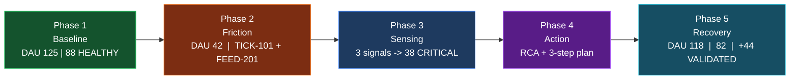
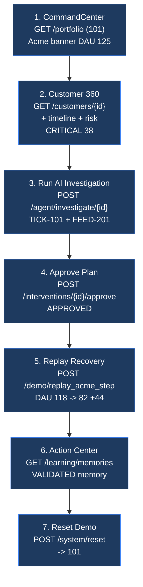

# RETAINAI -- Demo Guide

> **Start here for judges and live demos.** This guide covers the 5-phase Acme story, the 2-minute winning script, the exact click path, alternative scenarios, and reliability guarantees.

## 1. Project Overview

- **Name:** RETAINAI
- **Tagline:** Don't wait for churn. Let AI learn how to prevent it.
- **Operating Model:** `SENSE -> THINK -> ACT -> MEASURE -> LEARN -> REPEAT`
- **Tech Stack:** Python 3.11+, FastAPI, SQLAlchemy Async, SQLite/PostgreSQL, React 18, TypeScript, Tailwind CSS, Vite.

---

## 2. Hero Customer -- Acme Corp Quick Reference

| Field | Value | Source |
|---|---|---|
| **Name** | Acme Corp | `data/seed/retainai_dataset_v2.json` |
| **ID** | `b2a88551-82e5-43d7-b620-ba1640900c71` | `data/seed/retainai_dataset_v2.json` + `backend/src/retainai/demo/acme_replay.py:31` |
| **Domain** | `acmecorp.com` | seed |
| **Tier / Segment** | Enterprise | seed |
| **ARR / MRR** | $144,000 / $12,000 | `mrr=12000` x12; legacy `DEMO.md` $180k is stale |
| **CSM** | Sarah Johnson | seed |
| **Archetype** | `ACME_HERO` health 88.0 HEALTHY | `backend/src/retainai/scripts/seed_database.py:44` |

**Dataset snapshot:** `data/seed/retainai_dataset_v2.json` metadata `dataset-v2` seed 42 -- **101 customers**, **3131 usage_events**, **82 support_tickets**, **94 customer_feedbacks**. Archetypes: `HEALTHY 60`, `EARLY_WARNING 19`, `AT_RISK 12`, `RECOVERING 7`, `CRITICAL 2`, `ACME_HERO 1`.

> Scenario alias: `data/scenarios/demo_scenario_acme.json` uses `cust-acme-101` / `acme.com` / `mrr 12500` / `Sarah Jenkins` as a design-time JSON. The seeded DB identity is `b2a88551...` / `acmecorp.com` / `12000` / `Sarah Johnson`. `backend/src/retainai/demo/acme_replay.py:21` resolves by `ilike %acme%` with fallback to the UUID, so either works but verify via DB lookup.

---

## 3. Five-Phase Acme Story



| Phase | What happens | Signals / DAU | Health | File |
|---|---|---|---|---|
| **1 Baseline** | 25 healthy usage summaries DAU 125, license 88%, no open tickets, CSAT 5/5 | DAU 125, util 88.5% | 88 HEALTHY | `demo/acme_replay.py:42` step_healthy_baseline |
| **2 Friction** | TICK-101 HIGH BUG "CSV Export fails for datasets >10,000 rows" OPEN + FEED-201 NEG score 2 sentiment -0.85 + DAU 42 (util 32%) + 5 usage DAU 42 | `SEVERE_USAGE_DECLINE -50%` + `UNRESOLVED_CRITICAL_SUPPORT_TICKET` + `NEGATIVE_CUSTOMER_FEEDBACK` | 88 -> 38 CRITICAL | `demo/acme_replay.py:59` step_inject_friction |
| **3 Sensing** | Deterministic reassessment: `HealthEngine` 4-dim `0.4/0.3/0.2/0.1` + `RiskEngine` thresholds 20/40/60/80/90 + confidence `0.65+0.08*len` | 3 signals stacked | 38 CRITICAL confidence ~0.89 | `services/customer_service.py:28` + `engine/*` |
| **4 Action** | `InvestigationAgent` cites `TICK-101` + `FEED-201` -> root cause "Export friction blocked month-end reporting" -> `ActionStrategyAgent` matches memory `mem-001` (confidence 0.92) -> 3-step plan `ENGINEERING_ESCALATION_AND_EXECUTIVE_CHECKIN` + draft email | evidence_ids present | N/A | `agents/orchestrator.py:88` |
| **5 Recovery** | 7 usage events DAU 118, license 86%, TICK-101 RESOLVED, reassess 38 -> 82 | DAU 118 | 38 -> 82 delta +44 SUCCESS -> VALIDATED memory | `demo/acme_replay.py:111` step_post_intervention_recovery + `engine/learning_engine.py:37` |

```mermaid
gantt
    title Acme Health Timeline (5 Phases)
    dateFormat X
    axisFormat %L
    section Health
    Baseline (88 HEALTHY)       :done, p1, 0, 10
    Friction injection          :crit, p2, 10, 15
    Sensing (38 CRITICAL)       :crit, p3, 15, 20
    Action (Plan PROPOSED)      :active, p4, 20, 25
    Recovery (82 HEALTHY +44)   :done, p5, 25, 35
```



---

## 4. Two-Minute Winning Demo Script

### 0:00 - 0:20 | The Problem & The Shift
> "Customer success teams manage hundreds of accounts and usually discover dissatisfaction only after a customer has decided to leave. RETAINAI replaces static churn dashboards with an always-on autonomous customer-retention intelligence system."

Show `README.md` tagline + `docs/PRODUCT.md` gap table (Gainsight batch sync vs RETAINAI real-time + learning).

### 0:20 - 0:50 | Command Center & Customer 360 Sensing
> "In the RETAINAI Command Center, the system continuously monitors multi-dimensional telemetry: product usage, feature adoption, support friction, CSAT sentiment, and executive disengagement. Look at **Acme Corp** ($144k ARR): RETAINAI detects a compound churn signal -- usage dropped by 61% over 30 days while a critical support ticket remains unresolved."

**Click:** `Portfolio` table (`GET /api/v1/portfolio` -> 101) -- point to ARR at risk, risk distribution. Click Acme row -> `Customer 360` (`GET /customers/{id}/timeline?days=60`, `GET /customers/{id}/risk`).

### 0:50 - 1:25 | Agent Investigation Room & Root Cause Explanation
> "When we open the Investigation Room, the agent synthesizes evidence to diagnose the exact root cause: *Adoption Friction & Unresolved Support Bottlenecks*. Notice that every conclusion cites exact evidence IDs. The system also evaluates alternative explanations, like seasonal usage, before making a high-confidence prediction."

**Click:** `Run AI Investigation` -> `POST /api/v1/agent/investigate/b2a88551-82e5-43d7-b620-ba1640900c71` -> show `investigation.summary`, `root_cause`, `confidence`, `evidence_ids` pills, `recommended_action_summary`.

### 1:25 - 1:45 | Action Center & Personalized Retention Plan
> "Rather than displaying a raw ML score, RETAINAI formulates a personalized retention plan with step-by-step milestones and a draft outreach email grounded in Acme's specific context. With one click, the CSM can Approve or Execute the intervention."

**Show:** `retention_plan.plan_steps[3]` (Eng Escalation 48h -> CSM Exec Outreach Day 3 -> Product Onboarding Day 7) + `draft_email` subject/body citing TICK-101 patch. **Click:** `Approve` -> `POST /api/v1/interventions/{id}/approve` -> badge `APPROVED`.

### 1:45 - 2:00 | Closed-Loop Experience Memory & Learning
> "When the intervention is executed, RETAINAI observes post-intervention telemetry over a 14-day window, measures a +44 health rebound (38->82), and persists this outcome to its global **Experience Memory Bank**. The system learned that support escalation + executive check-ins yields a 79% success rate for FinTech accounts -- improving future recommendations across the entire portfolio."

**Click:** `Action Center` tab (`GET /learning/memories`) -> `mem-001` `confidence 0.92 VALIDATED` + new `mem_val_*` entry for Acme. Quote loop: `SENSE -> THINK -> ACT -> MEASURE -> LEARN -> REPEAT`.

---

## 5. Step-by-Step Click Path (Checklist)



```text
1. CommandCenter (portfolio 101) -> 2. Customer 360 (risk CRITICAL 38) -> 3. Run AI Investigation (evidence TICK-101/FEED-201)
-> 4. Approve (APPROVED) -> 5. Replay Recovery (82 +44) -> 6. Action Center (VALIDATED) -> 7. Reset
```

---

## 6. Alternative Scenarios (SC-01..08)

See `docs/AI_EVALUATION.md:14` benchmark matrix. Use for Q&A or edge demo:

| Scenario | Account | Signal Profile | Expected Risk | Root Cause | Plan |
|---|---|---|---|---|---|
| SC-01 | Apex Global | WAU steady, CSAT 5/5, 0 tickets | HEALTHY | N/A stable | Periodic QBR |
| SC-02 | Acme Corp | Usage -61%, 3 P1 open, CSAT 1/5 | CRITICAL | Support Friction & Adoption Drop | Escalation + Outreach |
| SC-03 | Logistics Pro | Usage -45%, JCR 98%, CSAT 5/5 | STABLE/WATCH | False Positive (Efficiency) | Value Confirmation |
| SC-04 | CloudTech Inc | Exec sponsor left, Admin 0 | HIGH_RISK | Stakeholder Disengagement | Sponsor Re-alignment |
| SC-05 | Delta Systems | CSAT 2/5, usage steady | WATCH | Negative Sentiment | Feedback Call |
| SC-06 | InnoLabs | Renewal 30d, usage -30%, no CSM meet | HIGH_RISK | Commercial & Adoption | Renewal Review |
| SC-07 | Zenith Retail | Ticket resolved, usage +38% | HEALTHY | Recovery | Record Success |
| SC-08 | OmniMedia | Incomplete data, 1 ticket | WATCH | Insufficient Telemetry | Request Sync |

> Gap: `retainai_dataset_v2.json` has no `FALSE_POSITIVE` archetype for SC-03; tested via manual `is_false_positive_candidate=True` in `backend/tests/test_engines.py:103`. Deterministic SC-02 math yields ~67.5 WATCH with 3 signals; CRITICAL requires added `ADMIN_INACTIVITY` or seeded archetype health 18.

---

## 7. Demo Reliability & Fallback

- **LLM deterministic fallback:** `backend/src/retainai/agents/llm_client.py:37` checks `api_key in (mock_key_for_dev, your_llm_api_key_here, "")` -> returns `model_validate(fallback_data)` without HTTP. Timeout 10s, fence stripping, fallback on any exception. Default `.env` is mock, so demo never depends on network.
- **Acme identity resilience:** `demo/acme_replay.py:21` resolves Acme via `ilike %acme%` with hardcoded fallback `b2a88551...`.
- **Idempotent seeding:** `scripts/seed_database.py:63` `drop_all+create_all` then loads `data/seed/retainai_dataset_v2.json` -> asserts 101/3131/82/94. Three reset ways:
  - CLI: `cd backend && uv run python -m retainai.scripts.seed_database`
  - API: `curl -X POST http://localhost:8000/api/v1/system/reset` `api/routes.py:29`
  - Frontend: `Reset Demo` button `frontend/src/App.tsx:19` calls `POST /system/reset` then reload
- **Replay engine endpoints:** `POST /api/v1/agent/demo/replay_acme_step?step=healthy|friction|recovery&intervention_id=inv_acme_001` -> deterministic `AcmeReplayEngine` steps.
- **Backup plan:** If frontend offline, curate Swagger `http://localhost:8000/docs` + CLI curls from `docs/DEVELOPMENT_GUIDE.md` verification section.

---

## 8. Verification Commands (Pre-Demo)

```bash
curl -s http://localhost:8000/health | jq                    # {"status":"ok",...}
curl -s http://localhost:8000/api/v1/portfolio | jq .metrics.total_customers  # 101
curl -s http://localhost:8000/api/v1/customers/b2a88551-82e5-43d7-b620-ba1640900c71 | jq '{health_score, risk_level}'
curl -s -X POST http://localhost:8000/api/v1/agent/investigate/b2a88551-82e5-43d7-b620-ba1640900c71 | jq '{run_id, intervention_id}'
curl -s http://localhost:8000/api/v1/learning/memories | jq length  # alias: /experience-memory
cd backend && uv run pytest -v   # ~25 passed
cd ../frontend && npm run build  # tsc && vite build
```

PowerShell equivalents in `docs/DEVELOPMENT_GUIDE.md`.

---

## 9. Troubleshooting

| Failure | Cause | Fix |
|---|---|---|
| Portfolio shows <101 or 0 | DB not seeded after docker up | `POST /api/v1/system/reset` or `uv run python -m retainai.scripts.seed_database` |
| Acme not found | Name mismatch (cust-acme-101 vs b2a88551) | Use UUID `b2a88551-82e5-43d7-b620-ba1640900c71` or rely on replay resolver |
| Investigation returns INSUFFICIENT_EVIDENCE | Health >60 + <2 categories | Inject friction via `replay_acme_step?step=friction` to populate signals |
| Health 67 WATCH not CRITICAL after friction | Only 3 signals stacked -> 67.5 (see ENGINE_REFERENCE) | Also depends on `ADMIN_INACTIVITY`; seeded CRITICAL archetype uses health 18 directly |
| Frontend blank, API ok | `VITE_API_BASE_URL` baked at build | Rebuild frontend after env change; fallback is proxy `/api` -> `localhost:8000` (`vite.config.ts:7`) |
| `curl: not found` in backend container | `python:3.11-slim` lacks curl (healthcheck gap `docker-compose.yml:17`) | Use `wget` or add `apt-get install curl` in Dockerfile |

---

## 10. Demo Checklist (13 Steps)

1. Portfolio 101 verified
2. Acme hero identity confirmed ($144k not $180k)
3. Timeline shows usage + ticket + feedback + activity
4. Signals show compound (3+ types)
5. Risk CRITICAL or WATCH with evidence
6. Investigation cites TICK-101/FEED-201
7. Plan has 3 steps + draft email with patch ref
8. Approve -> status APPROVED
9. Outcome health delta +44 -> SUCCESS
10. Memory shows new VALIDATED entry
11. Reset idempotent (counts stable on re-reset)
12. Fallback works with mock key (no network)
13. Swagger `/docs` fallback ready

---

## 11. Q&A Prep (Top 6)

1. **Why deterministic not pure LLM?** Math/validation in engines (`engine/*`), LLM only for synthesis/plan/email -- prevents hallucinating percentages (`IMPLEMENTATION_PLAN.md:9`).
2. **Why single orchestrator not swarm?** One `AgentOrchestrator` + 5 tools avoids chatter; `agents/orchestrator.py:34` sequential, auditable.
3. **How is false positive handled?** `is_false_positive_candidate` + `job_completion_rate` + `FALSE_POSITIVE_SAFEGUARD -35` (`signal_engine.py:100`) -- documented gap where `HealthEngine` ignores `USAGE_CONTEXT` (see `ENGINE_REFERENCE.md`).
4. **What is learned?** `health_delta >=15` creates `ExperienceMemory` confidence 0.92 `VALIDATED` -> future `query_experience_memory` boosts similar segment/risk plans.
5. **Evidence groundedness?** Every claim must cite `evidence_ids`; `IN SUFFICIENT_EVIDENCE` guard when `<2` sources (`investigation_agent.py:65`).
6. **What fails if LLM down?** Deterministic fallback data hardcoded in both agents (`investigation_agent.py:79`, `action_agent.py:43`) -- demo never blocks.

---

*Last synced 2026-08-30. Primary references: `backend/src/retainai/demo/acme_replay.py`, `backend/src/retainai/agents/orchestrator.py:34`, `data/scenarios/demo_scenario_acme.json`, `docs/AI_EVALUATION.md`.*

