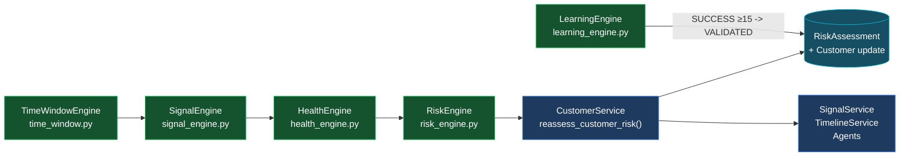

# RETAINAI -- Deterministic Engines Reference

> All engines are **pure / deterministic / LLM-free**. Agents may consume their outputs but
> never alter the math. This document is the normative specification; when it conflicts with the
> codebase, the code wins -- open a fix PR and relink.
>
> Code links use `backend/src/retainai/...:line` from the 2026-08-30 snapshot.

---

## 1. Engine Map



```text
engine/health_engine.py      ─┐
engine/signal_engine.py      ─┼─> services/customer_service.reassess_customer_risk()
engine/risk_engine.py        ─┘        ↓  (persists RiskAssessment, updates Customer)
engine/time_window.py        ─┘        └─> services/signal_service, timeline_service, agents
engine/learning_engine.py    ───> post-intervention outcome + ExperienceMemory validation gate
```

**Call hierarchy:**

```
CustomerService.reassess_customer_risk(customer_id)
  ├── TelemetryRepository.get_*(30d)
  ├── SignalEngine.evaluate_all_signals(usage, tickets, feedback, events)
  ├── HealthEngine.compute_health_components(signals, weights=settings.health_weights)
  └── RiskEngine.evaluate_risk(health, signals, total_data_points)
EventIngestionService.ingest_event -> CustomerService.reassess_customer_risk
TimelineService / SignalService / Agents -> engine methods directly
LearningEngine.evaluate_intervention_outcome -> (on SUCCESS) _process_learning_candidate -> MemoryRepository
```

---

## 2. HealthEngine

**File:** `backend/src/retainai/engine/health_engine.py:16`

### 2.1 Data type

```python
@dataclass
class HealthComponents:
    usage_health: float        # 0..100, starts 100
    support_health: float      # 0..100, starts 100
    sentiment_health: float    # 0..100, starts 100
    engagement_health: float   # 0..100, starts 100
    overall_health: float      # weighted composite, 0..100, rounded to 1 decimal
```

*The 4-dimension choice is canonical.* Do not reintroduce the 6-dimension draft from stale docs
(`product_health`, `relationship_health`, etc.) -- those columns do not exist in `models.py`.

### 2.2 Inputs

* `signals: List[DetectedSignal]` -- from `SignalEngine` (typically `evaluate_all_signals`)
* `weights: HealthWeights = settings.health_weights` -- `usage=0.40, support=0.30, sentiment=0.20, engagement=0.10`
  from `backend/src/retainai/config/settings.py:36`

### 2.3 Algorithm

`compute_health_components` at `health_engine.py:16`:

```python
usage_h = support_h = sentiment_h = engagement_h = 100.0
for s in signals:
    if s.category == "USAGE":    usage_h     -= s.impact_score
    elif s.category == "SUPPORT": support_h  -= s.impact_score
    elif s.category == "FEEDBACK": sentiment_h -= s.impact_score
    elif s.category == "ACTIVITY": engagement_h -= s.impact_score
    # else: ignored -- USAGE_CONTEXT, COMPOUND, etc. are NO-OPs today

usage_h     = clamp(usage_h, 0, 100)
support_h   = clamp(support_h, 0, 100)
sentiment_h = clamp(sentiment_h, 0, 100)
engagement_h= clamp(engagement_h, 0, 100)

composite = usage_h*0.4 + support_h*0.3 + sentiment_h*0.2 + engagement_h*0.1
return HealthComponents(..., round(x,1) for all five)
```

* `impact_score` is a **subtractive penalty**; the only negative score in the system today is
  `FALSE_POSITIVE_SAFEGUARD (-35)`, which is intentionally ignored here (see §7).
* Clamping happens **after** subtraction, **before** weighting.
* Weights are **not** re-normalized -- callers must ensure `sum == 1.0`.

### 2.4 Worked Example

No signals:

```
usage=100, support=100, sentiment=100, engagement=100
overall = 100*0.4 + 100*0.3 + 100*0.2 + 100*0.1 = 100.0
risk = HEALTHY  (health >= 90)
```

Moderate churn case -- 3 signals firing:

| Signal | Category | Impact |
|---|---|---|
| `MODERATE_USAGE_DECLINE` | USAGE | 25.0 |
| `UNRESOLVED_CRITICAL_SUPPORT_TICKET` | SUPPORT | 35.0 |
| `NEGATIVE_CUSTOMER_FEEDBACK` | FEEDBACK | 30.0 |

```
usage_h     = 100 - 25 = 75.0
support_h   = 100 - 35 = 65.0
sentiment_h = 100 - 30 = 70.0
engagement_h= 100      =100.0
overall = 75*0.4 + 65*0.3 + 70*0.2 + 100*0.1
        = 30.0  + 19.5 + 14.0 + 10.0
        = 73.5  -> round 73.5
risk = WATCH (60 <= 73.5 < 80), risk_score=(100-73.5)/100=0.26
```

Severe case -- add `SEVERE_USAGE_DECLINE (40)` + `ADMIN_INACTIVITY (15)` instead:

```
usage=60, support=65, sentiment=70, engagement=85
overall = 60*0.4 + 65*0.3 + 70*0.2 + 85*0.1 = 24+19.5+14+8.5 = 66.0
risk = WATCH  (still). With both usage + support critical paths the composite can reach <40 -> HIGH_RISK.
```

Clamping example -- 4 severe usage signals would stack to `-160` if not clamped:

```
usage before clamp = 100 - 40 - 40 - 40 = -20 -> clamp(0)
```

### 2.5 Properties & Guarantees

* `overall_health` is always in `[0.0, 100.0]` and rounded to 1 decimal.
* Order of signals does not matter -- insertion is commutative via addition, clamped only at the end.
* Floating-point note: `round(73.55, 1)` may produce `73.5` (bankers rounding in CPython); the engines
  never depend on a `.05` boundary for thresholding, so this is benign.

---

## 3. RiskEngine

**File:** `backend/src/retainai/engine/risk_engine.py:10`

### 3.1 Data type

```python
@dataclass
class RiskResult:
    health_score: float
    risk_level: RiskLevel       # 6-value enum (models.py:14)
    risk_score: float           # 0.0..1.0, rounded to 2 decimals
    confidence: float           # 0.0..1.0, rounded to 2 decimals
    detected_signals: List[str] # signal_type strings
    is_insufficient_data: bool
    evidence_ids: List[str]     # deduped union of signal.evidence_ids
```

### 3.2 Thresholds

`RiskEngine.map_health_to_risk_level` at `risk_engine.py:18`:

| Health `h` | RiskLevel | Config source |
|---|---|---|
| `h < 20` | `CRITICAL` | `settings.RISK_CRITICAL_THRESHOLD = 20.0` |
| `20 <= h < 40` | `HIGH_RISK` | `settings.RISK_HIGH_THRESHOLD = 40.0` |
| `40 <= h < 60` | `AT_RISK` | `settings.RISK_AT_RISK_THRESHOLD = 60.0` |
| `60 <= h < 80` | `WATCH` | `settings.RISK_WATCH_THRESHOLD = 80.0` |
| `80 <= h < 90` | `STABLE` | **hardcoded `90.0` at `risk_engine.py:30`** -- no setting |
| `h >= 90` | `HEALTHY` | fallback |

Visual (lower health = higher risk):

```
0        20        40        60        80    90     100
|---------|---------|---------|---------|-----|-------|
 CRITICAL  HIGH_RISK  AT_RISK   WATCH   STABLE HEALTHY
                    health increasing ->
```

Boundary behavior: `map_health_to_risk_level` uses `<` guards in ascending order, so `80.0` is
`STABLE` and `90.0` is `HEALTHY`. There are no tests that depend on an `== boundary` negative;
if you change thresholds, add an explicit boundary test.

### 3.3 Risk Score

```python
raw_risk_score = clamp((100.0 - health.overall_health) / 100.0, 0, 1)
risk_score = round(raw_risk_score, 2)   # risk_engine.py:40
```

Linear, inverse of health. Examples:

| Health | Risk score |
|---|---|
| 100.0 | 0.00 |
| 88.0 (Acme baseline) | 0.12 |
| 73.5 | 0.26 |
| 42.0 (AT_RISK archetype) | 0.58 |
| 18.0 (CRITICAL archetype) | 0.82 |

### 3.4 Insufficient-Data Guard

`RiskEngine.evaluate_risk` at `risk_engine.py:31`:

```python
if total_data_points < 3:
    return RiskResult(
        health_score=health.overall_health,
        risk_level=RiskLevel.WATCH,
        risk_score=0.30, confidence=0.40,
        detected_signals=["INSUFFICIENT_DATA_BASELINE"],
        is_insufficient_data=True, evidence_ids=[])
```

* `total_data_points = len(usage)+len(tickets)+len(feedback)+len(events)` as computed in
  `CustomerService.reassess_customer_risk` at `customer_service.py:26`.
* The `WATCH / 0.30 / 0.40 / INSUFFICIENT_DATA_BASELINE` tuple is **hardcoded** -- no setting.
* Confidence is *not* derived from the normal `min(0.95, 0.65+...)` formula on this path.
* Health is still computed normally; only risk/confidence/signals are overridden.

### 3.5 Confidence

Normal path (`risk_engine.py:47`):

```python
confidence = min(0.95, 0.65 + len(signals) * 0.08)
confidence = round(confidence, 2)
```

| # signals | Confidence |
|---|---|
| 0 | 0.65 |
| 1 | 0.73 |
| 2 | 0.81 |
| 3 | 0.89 |
| 4 | 0.95 (capped from 0.97) |
| 5+ | 0.95 |

Capped at `0.95` even if all 5 detector kinds fire.

---

## 4. SignalEngine

**File:** `backend/src/retainai/engine/signal_engine.py:10`

### 4.1 DetectedSignal

```python
@dataclass
class DetectedSignal:
    signal_type: str    # e.g. SEVERE_USAGE_DECLINE
    category: str       # USAGE / SUPPORT / FEEDBACK / ACTIVITY / COMPOUND / USAGE_CONTEXT
    severity: str       # LOW / MEDIUM / HIGH / CRITICAL
    value: float
    baseline: float
    delta_pct: float
    summary: str
    evidence_ids: List[str] = field(default_factory=list)
    impact_score: float = 0.0

    @property
    def direction(self) -> str: "DECLINING" if delta_pct < 0 else "STABLE"
    @property
    def magnitude(self) -> float: delta_pct
```

* `value` = current-period metric (DAU mean, ticket count, score, etc.).
* `baseline` = 30-day reference mean (or synthetic guard value).
* `delta_pct` = percent delta ` (value-baseline)/baseline*100 ` as computed by `TimeWindowEngine`.

### 4.2 Detector Catalog

The 7 concrete `signal_type` values the codebase can emit:

| # | `signal_type` | Method | Triggers (predicate) | `category` | `severity` | `impact` | Typical `summary` |
|---|---|---|---|---|---|---|---|
| 1 | `SEVERE_USAGE_DECLINE` | `detect_usage_decline_signals` | `calculate_usage_window_delta(7d vs 30d).percentage_delta <= -50` | `USAGE` | `CRITICAL` | `40.0` | `"DAU dropped 57.3% over last 7 days (from 120 to 51)."` |
| 2 | `MODERATE_USAGE_DECLINE` | `detect_usage_decline_signals` | `-50 < delta <= -25` | `USAGE` | `HIGH` | `25.0` | `"DAU declined 32.1% compared to 30-day baseline."` |
| 3 | `UNRESOLVED_CRITICAL_SUPPORT_TICKET` | `detect_support_friction_signals` | exists ticket with `severity in (HIGH,CRITICAL,URGENT)` and `status in (OPEN,IN_PROGRESS)` | `SUPPORT` | `CRITICAL` | `35.0` | `"{n} open high-severity support ticket(s) ...: '{subject}'."` |
| 4 | `HIGH_TICKET_VOLUME_SPIKE` | `detect_support_friction_signals` | no critical-unresolved but `len(open_tickets) >= 3` | `SUPPORT` | `HIGH` | `20.0` | `"Spike in unresolved support requests (4 open tickets)."` |
| 5 | `NEGATIVE_CUSTOMER_FEEDBACK` | `detect_sentiment_signals` | exists `feedback` with `sentiment==NEGATIVE` or `score<=2` (uses `feedback[0]` as exemplar) | `FEEDBACK` | `HIGH` | `30.0` | `"Negative feedback recorded (CSAT_SURVEY): '...'"` |
| 6 | `ADMIN_INACTIVITY` | `detect_admin_inactivity_signals` | `len(events)>0` and no `event_type in (ADMIN_LOGIN,ADMIN_ACTIVITY)` within `now-14d` (UTC-aware compare) | `ACTIVITY` | `MEDIUM` | `15.0` | `"No admin activity or workspace logins detected in last 14 days."` |
| 7 | `FALSE_POSITIVE_SAFEGUARD` | `evaluate_signals` only | `customer.is_false_positive_candidate is True` | `USAGE_CONTEXT` | `LOW` | `-35.0` | `"High job completion efficiency indicates false positive risk candidate."` |

Two additional signals are **not emitted by the engine but by `RiskEngine`** when the guard fires:

* `INSUFFICIENT_DATA_BASELINE` -- risk-level pseudo-signal for `<3` total points (see §3.4).

No `COMPOUND` signal type is produced today -- category `COMPOUND` is reserved for future compound-rule work.

Evidence wiring: each detector copies the last-5 usage ids, the specific ticket ids, the single feedback id,
or the first-3 account event ids into `evidence_ids`. Consumers collect them via `RiskEngine` dedup.

### 4.3 Aggregators

* `SignalEngine.evaluate_all_signals(usage, tickets, feedback, events) -> List[DetectedSignal]`
  at `signal_engine.py:90` -- sequential union of the four primary detectors.
  **This is the path used everywhere in production** (services, timeline, reassess).

* `SignalEngine.evaluate_signals(customer, usage, tickets, feedback, events, reference_date=None)
  -> List[DetectedSignal]` at `signal_engine.py:100` -- calls `evaluate_all_signals(...)` then
  *conditionally* appends `FALSE_POSITIVE_SAFEGUARD` if `customer.is_false_positive_candidate`.
  `reference_date` is accepted but unused today.

### 4.4 Detector Internals

#### Usage Decline

`detect_usage_decline_signals` at `signal_engine.py:28`:

```python
cmp = TimeWindowEngine.calculate_usage_window_delta(usage_events, current_days=7, baseline_days=30)
evidence_ids = [e.id for e in usage_events[-5:]]
if cmp.percentage_delta <= -50:  # SEVERE
elif cmp.percentage_delta <= -25:  # MODERATE
```

* Metric is mean `daily_active_users` (fallback `active_users`) -- not `wau/mau/sessions`.
* Exclusive severity: at most **one** usage signal per evaluation (SEVERE shadows MODERATE).
* Evidence is recency-based (last 5 events by list order; callers pass `TelemetryRepository` results
  which are `timestamp ASC`, so this is the 5 most recent points).

#### Support Friction

`detect_support_friction_signals` at `signal_engine.py:55`:

```python
open_tickets = [t for t in tickets if t.status in ("OPEN","IN_PROGRESS")]
unresolved_critical = [t for t in open_tickets if t.severity in ("HIGH","CRITICAL","URGENT")]
if unresolved_critical:  # CRITICAL, impact 35
elif len(open_tickets) >= 3:  # HIGH, impact 20
```

Priority is strict -- critical suppresses volume. `RESOLVED`/`CLOSED` tickets are ignored for both paths.
Test coverage at `backend/tests/test_signal_engine.py:40` anchors `HIGH+OPEN -> CRITICAL`.

#### Sentiment

`detect_sentiment_signals` at `signal_engine.py:95`:

```python
negative_entries = [f for f in feedback_entries if f.sentiment=="NEGATIVE" or (f.score and f.score<=2)]
if negative_entries: emit HIGH 30 using negative_entries[0]
```

Predicate is `OR` -- low numeric score alone triggers even if sentiment is `POSITIVE`.
Only the first negative entry is used as the exemplar (`value = score or 1, baseline=5, delta=-80`).

#### Admin Inactivity

`detect_admin_inactivity_signals` at `signal_engine.py:116`:

```python
now = datetime.now(timezone.utc)
recent_logins = [e for e in events
                 if e.event_type in ("ADMIN_LOGIN","ADMIN_ACTIVITY")
                 and tz_aware(e.timestamp) >= now-14d]
if not recent_logins and len(events)>0: emit MEDIUM 15
```

* No-op if `events` is empty (new accounts don't fire).
* TZ handling: naive `timestamp` is assumed UTC (`.replace(tzinfo=timezone.utc)`).
* Only two `event_type` strings are recognized -- `ADMIN_LOGIN` and `ADMIN_ACTIVITY`.

---

## 5. TimeWindowEngine

**File:** `backend/src/retainai/engine/time_window.py:10`

### 5.1 WindowComparison

```python
@dataclass
class WindowComparison:
    current_value: float
    baseline_value: float
    absolute_delta: float
    percentage_delta: float
    trend_direction: str   # INCREASING / DECREASING / STABLE
    is_insufficient_data: bool
```

### 5.2 compare_periods

`TimeWindowEngine.compare_periods` at `time_window.py:16`:

```python
def compare_periods(current_series, baseline_series, min_baseline_threshold=1.0) -> WindowComparison:
    if not current_series or not baseline_series:
        return WindowComparison(0,0,0,0, "STABLE", is_insufficient_data=True)
    avg_current  = mean(current_series)
    avg_baseline = mean(baseline_series)
    abs_delta = avg_current - avg_baseline
    # divide-by-zero / sparse-baseline guard
    if avg_baseline < min_baseline_threshold:
        pct_delta = 0.0 if avg_current < min_baseline_threshold else 100.0
    else:
        pct_delta = (avg_current - avg_baseline) / avg_baseline * 100
    trend = "INCREASING" if pct_delta > 5 else "DECREASING" if pct_delta < -5 else "STABLE"
    return WindowComparison(round(avg_current,2), round(avg_baseline,2),
                            round(abs_delta,2), round(pct_delta,2),
                            trend, is_insufficient_data=False)
```

* **Divide-by-zero guard:** `min_baseline_threshold=1.0` means a baseline near zero does not explode
  `pct_delta` to `-100%` or `inf`. Instead `0.0` or `100.0` is returned (sparse-customer guard).
* **Trend threshold:** strictly `>5` / `<-5` (so `+5.0` and `-5.0` are `STABLE`). All rounding is to 2 decimals.
* Both return values feed the signal detectors directly, so changing the `±5` boundary shifts which
  trends count as `STABLE`.

### 5.3 calculate_usage_window_delta

`TimeWindowEngine.calculate_usage_window_delta` at `time_window.py:55`:

```python
def calculate_usage_window_delta(usage_events, current_days=7, baseline_days=30) -> WindowComparison:
    if not usage_events: return WindowComparison(..., is_insufficient_data=True)
    now = datetime.now(timezone.utc)
    current_cutoff  = now - timedelta(days=7)
    baseline_cutoff = now - timedelta(days=30)

    _get_dau(evt) = daily_active_users if >0 else active_users   # float
    _get_ts(evt)  = ts mapped UTC-aware if naive

    current_daus  = [_get_dau(e) for e in usage_events if _get_ts(e) >= current_cutoff]
    baseline_daus = [_get_dau(e) for e in usage_events if baseline_cutoff <= _get_ts(e) < current_cutoff]
    if not baseline_daus: baseline_daus = [_get_dau(e) for e in usage_events]  # sparse fallback
    return compare_periods(current_daus, baseline_daus)
```

* **Slicing is by wall-clock `now`** -- not by max event timestamp. Tests that fabricate old timestamps
  must shift them forward (see `backend/tests/test_signal_engine.py:8` using `now - timedelta(days=...)`).
* **Sparse fallback:** when no event falls in the baseline window, `baseline = all events` prevents
  `is_insufficient_data=True` and keeps the delta near `0` (rather than erroring).
* **Metric choice:** `DAU` only -- `wau/mau/license_utilization/usage_minutes` are not used by the window engine.

---

## 6. LearningEngine & Validation Gate

**File:** `backend/src/retainai/engine/learning_engine.py:16`

### 6.1 Outcome evaluation

`evaluate_intervention_outcome` at `learning_engine.py:22`:

```python
health_delta = health_after - health_before
if health_delta >= 15.0: status = SUCCESS
elif health_delta >= 0.0: status = NEUTRAL
else:                    status = FAILURE
# outcome fields:
#   id = f"outc_{intervention_id[:8]}_{int(now_ts)}"
#   health_before/after/delta (delta rounded to 1 decimal)
#   usage_before/after, customer_response, notes
#   status = evaluation_status = status   (both set identically)
#   confidence = 0.90  (hardcoded)
#   customer_id populated from intervention if found, else ""
#   await intervention_repo.create_outcome(outcome)
#   if status == SUCCESS: await _process_learning_candidate(intervention, outcome)
```

Thresholds are on **absolute health-point deltas**, not percents. `+15.0` is the `SUCCESS` bar,
`0.0` (any non-negative) is `NEUTRAL`. There is no time-decay or normalization.

`customer_id` empty-string fallback matters only when the intervention is missing -- in practice the
method early-fetches the intervention and then always populates it before persist.

### 6.2 Validation gate (`_process_learning_candidate`)

`_process_learning_candidate` at `learning_engine.py:55`:

```python
memory_id = f"mem_val_{intervention.customer_id[:5]}_{int(now_ts)}"
segment = explicit SELECT Customer.segment WHERE id==intervention.customer_id else "Enterprise"

memory = ExperienceMemory(
    id=memory_id,
    context_pattern=f"{segment} Account Recovery -- {intervention.action_type}",
    customer_segment=segment,
    risk_pattern=intervention.action_type or "HIGH_RISK_SUPPORT_BUG_FRICTION",
    signals=["UNRESOLVED_CRITICAL_TICKET", "USAGE_DECLINE", "NEGATIVE_FEEDBACK"],  # hardcoded
    recommended_strategy=intervention.action_type,
    actual_action=intervention.title,
    observed_outcome=f"Health recovered +{delta:.1f} points after intervention ({response or 'positive signal'}).",
    confidence=0.92,
    validation_status=ValidationStatus.VALIDATED,
    success_count=1, failure_count=0,
    evidence_ids=[intervention.id, outcome.id],
)
await memory_repo.add_memory(memory)
```

* **Only `SUCCESS` outcomes pass.** `NEUTRAL`/`FAILURE` stop at `create_outcome`.
* Hardcoded signals list (`3` entries) is a known stub -- future work should capture the real
  `RiskAssessment.detected_signals` that triggered the intervention.
* `confidence=0.92` (hardcoded) intentionally matches the seeded `mem-001` confidence for
  demo narrative consistency.
* Segment lookup avoids async lazy-load (`MissingGreenlet`) via an explicit `SELECT` -- see
  §7 / `BACKEND_GUIDE.md:13`.

### 6.3 Convenience wrapper

`LearningEngine.record_outcome` at `learning_engine.py:91` (class method):

```python
health_before = SELECT Customer.health_score WHERE id==intervention.customer_id else 40.0
health_after  = health_before + (delta_usage if success else -10.0)
return await evaluate_intervention_outcome(..., health_before, health_after,
                                           usage_before=50.0, usage_after=50.0+delta_usage)
```

`delta_usage` default is `15.0`, so `success=True` yields a `+15` delta that lands exactly on the
`SUCCESS` boundary. Passing `success=False` yields `-10` -> `FAILURE`.

---

## 7. False Positive Safeguard -- Known Discrepancy

### 7.1 What the code does today

* `SignalEngine.evaluate_signals(customer, ...)` at `signal_engine.py:100` checks
  `customer.is_false_positive_candidate` and appends:

  ```python
  DetectedSignal("FALSE_POSITIVE_SAFEGUARD", "USAGE_CONTEXT", "LOW",
                 value=0.95, baseline=1.0, delta_pct=0.0,
                 summary="High job completion efficiency ...",
                 evidence_ids=[], impact_score=-35.0)
  ```

* `HealthEngine.compute_health_components` at `health_engine.py:16` only subtracts `impact_score`
  for categories `USAGE / SUPPORT / FEEDBACK / ACTIVITY` -- `USAGE_CONTEXT` is a no-op, so the
  `-35` never changes any health dimension.
* `CustomerService.reassess_customer_risk` at `customer_service.py:28` calls
  `SignalEngine.evaluate_all_signals(...)` (not `evaluate_signals`), so the safeguard signal is
  never produced in the primary code path at all.

Net effect: **the safeguard has zero runtime impact today**, despite being seeded and narratively
referenced.

### 7.2 Why it was built that way

The original intent (per comments and dataset flags `is_false_positive_candidate`) was to let
high-efficiency usage declines (high `job_completion_rate`, low `sessions`, normal `DAU` drop) be
discounted -- classic "efficiency vs. decay" false positive. The negative `impact_score` was meant to
*raise* the depressed health dimension instead of lowering it, but the engine branch was never added.

### 7.3 Recommended fix (two-pass)

> Do not apply blindly -- file as a tracked issue and add a failing test first.

```python
# health_engine.py -- add branch before clamping:
elif s.category == "USAGE_CONTEXT":
    # false-positive safeguard is restorative: negative impact_score raises health
    usage_h -= s.impact_score     # e.g. 100 - (-35) => 135 -> clamped 100
    # or: apply to the most depressed dimension instead:
    # usage_h = min(100.0, usage_h - s.impact_score)

# customer_service.py -- route through the contextual path:
signals = SignalEngine.evaluate_signals(customer, usage, tickets, feedback, events)
# (keep evaluate_all_signals for non-customer-aware callers)
```

Alternative design if a restorative signal feels semantically odd: keep negative impact but give it its
own category weight (e.g. `context_health` capped at `0..100` with small weight `0.05`, rebalancing
the other four to `0.95`).

### 7.4 Test you should add

```python
def test_false_positive_safeguard_restores_usage_health():
    cust = Customer(is_false_positive_candidate=True, ...)
    signals = SignalEngine.evaluate_signals(cust, usage_declining, [], [], [])
    assert any(s.signal_type == "FALSE_POSITIVE_SAFEGUARD" for s in signals)
    health = HealthEngine.compute_health_components(signals)
    # after fix, usage_h must be higher than without safeguard
    assert health.usage_health > 60.0  # or whatever bound you pick
```

Until this ships, doc references to the safeguard must be annotated with
`⚠️ no-op in current reassess path`.

---

## 8. Magic Numbers -- Complete Table

| Constant | Value | File:Line | Used by | Tune? |
|---|---|---|---|---|
| `HEALTH_WEIGHT_USAGE` | `0.40` | `config/settings.py:36` | `HealthEngine` | yes (env) |
| `HEALTH_WEIGHT_SUPPORT` | `0.30` | `config/settings.py:36` | `HealthEngine` | yes |
| `HEALTH_WEIGHT_SENTIMENT` | `0.20` | `config/settings.py:36` | `HealthEngine` | yes |
| `HEALTH_WEIGHT_ENGAGEMENT` | `0.10` | `config/settings.py:36` | `HealthEngine` | yes |
| `RISK_CRITICAL_THRESHOLD` | `20.0` | `config/settings.py:40` | `RiskEngine.map` | yes |
| `RISK_HIGH_THRESHOLD` | `40.0` | `config/settings.py:40` | `RiskEngine.map` | yes |
| `RISK_AT_RISK_THRESHOLD` | `60.0` | `config/settings.py:40` | `RiskEngine.map` | yes |
| `RISK_WATCH_THRESHOLD` | `80.0` | `config/settings.py:40` | `RiskEngine.map` | yes |
| `STABLE->HEALTHY boundary` | `90.0` | `engine/risk_engine.py:30` | `RiskEngine.map` | no -- hardcoded |
| `insufficient_data threshold` | `3` points | `engine/risk_engine.py:31` | `RiskEngine.evaluate_risk` | no |
| `insufficient risk_score` | `0.30` | `engine/risk_engine.py:35` | `RiskEngine` guard | no |
| `insufficient confidence` | `0.40` | `engine/risk_engine.py:35` | `RiskEngine` guard | no |
| `confidence base` | `0.65` | `engine/risk_engine.py:47` | `RiskEngine` | no |
| `confidence per signal` | `0.08` | `engine/risk_engine.py:47` | `RiskEngine` | no |
| `confidence cap` | `0.95` | `engine/risk_engine.py:47` | `RiskEngine` | no |
| `SEVERE usage threshold` | `-50%` | `engine/signal_engine.py:38` | `Usage decline` | no |
| `MODERATE usage threshold` | `-25%` | `engine/signal_engine.py:45` | `Usage decline` | no |
| `impact SEVERE_USAGE_DECLINE` | `40.0` | `engine/signal_engine.py:46` | `HealthEngine` | no |
| `impact MODERATE_USAGE_DECLINE` | `25.0` | `engine/signal_engine.py:54` | `HealthEngine` | no |
| `impact UNRESOLVED_CRITICAL_TICKET` | `35.0` | `engine/signal_engine.py:75` | `HealthEngine` | no |
| `impact HIGH_TICKET_VOLUME_SPIKE` | `20.0` | `engine/signal_engine.py:88` | `HealthEngine` | no |
| `impact NEGATIVE_FEEDBACK` | `30.0` | `engine/signal_engine.py:107` | `HealthEngine` | no |
| `impact ADMIN_INACTIVITY` | `15.0` | `engine/signal_engine.py:139` | `HealthEngine` | no |
| `impact FALSE_POSITIVE_SAFEGUARD` | `-35.0` | `engine/signal_engine.py:168` | (no-op today) | no |
| `admin inactivity window` | `14 days` | `engine/signal_engine.py:119` | `Admin inactivity` | no |
| `usage window current` | `7 days` | `engine/time_window.py:58` | `TimeWindowEngine` | no |
| `usage window baseline` | `30 days` | `engine/time_window.py:58` | `TimeWindowEngine` | no |
| `min_baseline_threshold` | `1.0` | `engine/time_window.py:18` | `TimeWindowEngine` | param |
| `trend INCREASING bound` | `>5%` | `engine/time_window.py:36` | `TimeWindowEngine` | no |
| `trend DECREASING bound` | `<-5%` | `engine/time_window.py:38` | `TimeWindowEngine` | no |
| `learning SUCCESS delta` | `>=15.0` | `engine/learning_engine.py:27` | `LearningEngine` | no |
| `learning NEUTRAL delta` | `>=0.0` | `engine/learning_engine.py:29` | `LearningEngine` | no |
| `learning outcome confidence` | `0.90` | `engine/learning_engine.py:43` | `LearningEngine` | no |
| `learning memory confidence` | `0.92` | `engine/learning_engine.py:80` | validation gate | no |
| `DAU WARNING boundary` | `50` | `services/timeline_service.py:21` | `TimelineService` | no |
| `telemetry default window` | `30 days` | `repositories/telemetry_repository.py:22` | `TelemetryRepository` | param |
| `timeline default window` | `60 days` | `services/timeline_service.py:13` | `TimelineService` | param |

Defaults for telemetry reads (`30d`) vs timeline (`60d`) are wired to the callers above, not the engines.

---

## 9. Precision & Rounding Policy

| Value | Rounding | Where |
|---|---|---|
| `HealthComponents.*` | `round(x, 1)` | `health_engine.py:31` |
| `WindowComparison.*` (current/baseline/abs/pct) | `round(x, 2)` | `time_window.py:44` |
| `RiskResult.risk_score` | `round(x, 2)` | `risk_engine.py:40` |
| `RiskResult.confidence` | `round(x, 2)` | `risk_engine.py:48` |
| `Customer.health_score` on persist | `round(x, 1)` | `repositories/customer_repository.py:27` |
| `InterventionOutcome.health_delta` | `round(x, 1)` | `engine/learning_engine.py:35` |

All risk comparisons use `<` with rounded health values -- do not micro-tune health to `79.95` to
expect deterministic `WATCH`; round first.

---

## 10. Agent vs Engine Boundary

* Engines are **synchronous, pure functions** (`@staticmethod`/`@classmethod`) -- no DB session, no I/O.
* Services are **async, impure** -- they `await` repos, commit, and persist `RiskAssessment`s.
* Agents (`investigation_agent.py`, `action_agent.py`, `orchestrator.py`) are **LLM-driven and non-deterministic**:
  they call `SignalService`/`TimelineService`/`EvidenceRepository`/`MemoryRepository` via tools
  (`agents/tools.py`) but must **not** replicate threshold logic in prompts. The contract is:
  *"agents explain and propose; engines decide health and risk."*

If you add a new detector, wire it into `SignalEngine` and update §4 of this doc -- do not add a
parallel detector inside an agent prompt.

---

## 11. Changelog Note

* 2026-08-30: initial 4-dimension health model (usage/support/sentiment/engagement). The stale
  `docs/DATA_MODEL.md` 6-dimension draft (`product_health` etc.) was retired -- see `BACKEND_GUIDE.md`.
* 2026-08-30: `FALSE_POSITIVE_SAFEGUARD` merged as `USAGE_CONTEXT` -- remains no-op in the reassess path;
  tracked as known discrepancy §7. Do not paper it over in product copy.

---

*End of engine reference. For storage and type detail see `docs/DATA_MODEL.md`; for service/route
wiring see `docs/BACKEND_GUIDE.md`.*

