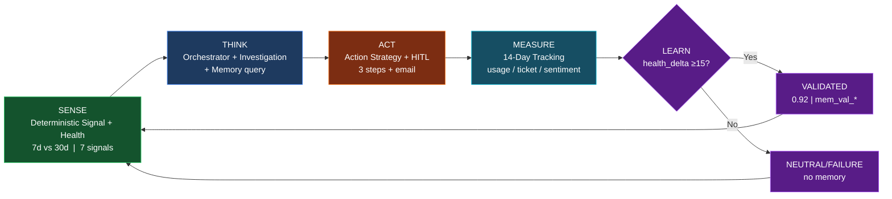
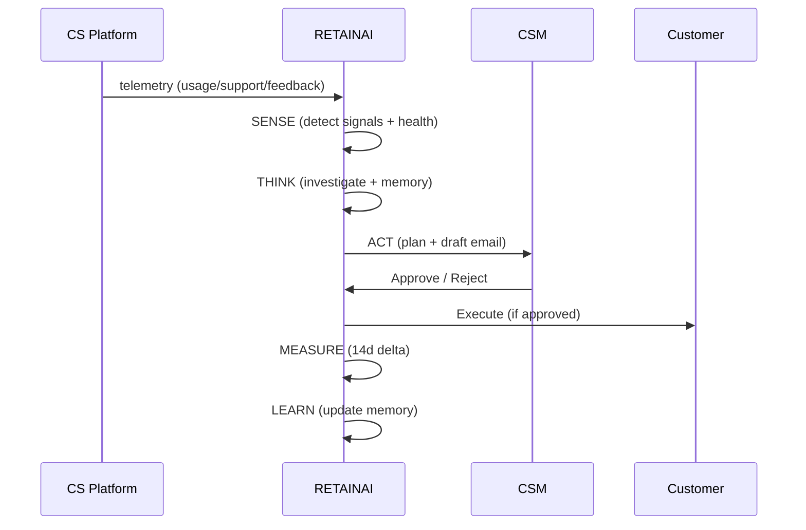

# RETAINAI -- Product Specification & Domain Research

> **Don't wait for churn. Let AI learn how to prevent it.**
> **Operating Model:** `SENSE -> THINK -> ACT -> MEASURE -> LEARN -> REPEAT`

---

## 1. Domain & Competitive Research

Customer Success (CS) teams manage portfolios of tens to hundreds of B2B SaaS accounts. Traditional customer success platforms (Gainsight, ChurnZero, Totango, Vitally, Planhat) rely heavily on static, rule-based health scores and manual playbooks.

### Competitor Gap Analysis

| Platform | Monitoring Capability | Health Scoring | Risk Explanation | Action Model | Learning Loop |
| :--- | :--- | :--- | :--- | :--- | :--- |
| **Gainsight / ChurnZero** | Batch data syncs | Weighted linear average | Vague color alerts (Red/Yellow) | Manual playbook execution | **None** (static playbooks) |
| **Totango / Vitally** | Event triggers | Component scores | Metric breakdown | Templated emails | **None** |
| **RETAINAI** | **Real-time event stream** | **Multi-dimensional health matrix + signal delta** | **Evidence-grounded root cause + confidence model** | **Personalized action plan + human-in-the-loop approval** | **Closed-loop experience memory bank** |

### Key Research Findings

1. **Activity vs. Outcome:** Lower login activity does *not* inherently equal churn. A customer who completes their implementation and achieves automated success requires fewer logins. RETAINAI explicitly accounts for job completion vs disengagement (False Positive handling via `is_false_positive_candidate` + `job_completion_rate` in `backend/src/retainai/db/models.py:88,124`).

2. **Compound Signals:** Single negative signals (e.g., 1 support ticket) are frequently noise. Compound signals (Usage decline ∧ Unresolved severity-1 ticket ∧ Admin inactivity ∧ Negative CSAT) indicate critical churn risk. Detected in `backend/src/retainai/engine/signal_engine.py:40-177`.

3. **The Actionability Gap:** Knowing an account is 82% churn-risk without an evidence-grounded action plan leaves CSMs frozen. Explanations must answer *Why* and *What to do next* -- RETAINAI generates step-by-step retention plans with draft emails via `backend/src/retainai/agents/action_agent.py:31`.

---

## 2. Core Problem Breakdown

1. **Problem A -- Signal Fragmentation:** Telemetry is scattered across Product Analytics, Support (Zendesk/Intercom), Feedback (NPS/CSAT), and CRM meetings. Solved via `Customer360` unified timeline `backend/src/retainai/services/timeline_service.py:17`.

2. **Problem B -- Delayed Detection:** Risk is surfaced 30-60 days too late (at renewal time or post-cancellation). Solved via event-driven `POST /api/v1/events` -> immediate `reassess_customer_risk` in `backend/src/retainai/services/event_ingestion_service.py:17`.

3. **Problem C -- Weak Explanation:** Black-box ML probability scores lack natural language reasoning and traceable evidence. Solved via Investigation Agent that cites `evidence_ids` `backend/src/retainai/agents/investigation_agent.py:46`.

4. **Problem D -- Action Gap:** Alerts lack customized, contextual intervention strategies. Solved via Action Strategy Agent + Experience Memory matching `backend/src/retainai/agents/orchestrator.py:88`.

5. **Problem E -- No Closed Learning Loop:** Organizations fail to track which interventions actually worked for specific account profiles, repeating ineffective outreach. Solved via `LearningEngine` validation gate `health_delta >=15 -> VALIDATED` `backend/src/retainai/engine/learning_engine.py:37`.

---

## 3. Product Vision & Principles

RETAINAI is an evidence-driven, explainable, self-improving customer retention agentic system. It operates as an always-on background intelligence layer that ingests customer events, deterministically computes health deltas, agentically investigates root causes using tools, plans tailored interventions, captures CSM feedback, and measures post-intervention outcomes to update its global experience memory.

**Principles:**
1. **Deterministic core, agentic reasoning** -- Math, thresholds, DB in `engine/` & `services/`; LLM only for synthesis/plan/email. Never let LLM do arithmetic (`docs/IMPLEMENTATION_PLAN.md:9`).
2. **Single Orchestrator + typed tools** -- Avoid multi-agent chatter; 5 canonical contracts (`docs/ai/tool-contracts.md`).
3. **Evidence-first** -- Every claim cites `evidence_ids`; `INSUFFICIENT_EVIDENCE` when `<2` sources.
4. **Closed loop:** `SENSE -> THINK -> ACT -> MEASURE -> LEARN -> REPEAT` -- `LearningEngine` validation.
5. **Demo reliability > novelty** -- Mock fallback on every LLM call, deterministic `b2a88551-...` Acme hero, `/system/reset` re-seeds 101.

---

## 4. Multi-Dimensional Health Matrix

> **Canonical MVP: 4 dimensions** -- `0.4*usage +0.3*support +0.2*sentiment +0.1*engagement` (`backend/src/retainai/config/settings.py:7`, `backend/src/retainai/engine/health_engine.py:48`). The 6-dim variant below is documented as **roadmap**; legacy `DATA_MODEL.md` listed 6 dims incorrectly for MVP.

### MVP Health Dimensions (Implemented)

| Dimension | Weight | Antecedent | Engine Input |
|---|---|---|---|
| **Product / Usage Health** | 0.40 | WAU/MAU ratio, DAU decline `SEVERE -50% / MODERATE -25%` `signal_engine.py:48` | `USAGE` signals `impact 40/25` |
| **Support Health** | 0.30 | Ticket volume, unresolved critical tickets `35/20` | `SUPPORT` signals |
| **Sentiment Health** | 0.20 | NPS/CSAT, `NEGATIVE` or `score<=2` `impact 30` | `FEEDBACK` signals |
| **Engagement Health** | 0.10 | Admin active days, `ADMIN_INACTIVITY 14d` `impact 15` | `ACTIVITY` signals |
| **Overall Health** | 1.0 | Weighted composite clamped 0-100 rounded 1 decimal | `health_engine.py:48` |

### Roadmap: 6-Dimension Vision (Future, Stage 5+)

1. **Product Health:** WAU/MAU ratio, core feature usage frequency, session duration.
2. **Engagement Health:** Admin active days, stakeholder meeting cadence, email responses.
3. **Support Health:** Ticket volume, unresolved critical tickets, SLA breaches, time-to-resolution.
4. **Sentiment Health:** Qualitative NPS feedback, CSAT ratings, support chat sentiment score.
5. **Relationship Health:** Executive sponsor engagement, multi-department adoption width.
6. **Commercial Health:** ARR tier, contract tenure, time remaining until renewal date.

> Overall risk level (`HEALTHY`, `STABLE`, `WATCH`, `AT_RISK`, `HIGH_RISK`, `CRITICAL`) is derived from dimension scores, compound signal detection, and baseline deltas (`backend/src/retainai/engine/risk_engine.py:26`, thresholds `20/40/60/80/90`).

### Risk Thresholds

```
health <20 -> CRITICAL
health <40 -> HIGH_RISK
health <60 -> AT_RISK
health <80 -> WATCH
health <90 -> STABLE
else     -> HEALTHY   # 90 hardcoded in risk_engine.py:35
```

Seed archetype mapping `backend/src/retainai/scripts/seed_database.py:44`: `ACME_HERO 88.0 HEALTHY`, `HEALTHY 92.5`, `EARLY_WARNING 68.0 WATCH`, `AT_RISK 42.0`, `CRITICAL 18.0`.

---

## 5. Operating Model Deep Dive



<details>
<summary>Text fallback</summary>

```
SENSE (Signal+Health 7d/30d) -> THINK (Orchestrator+Investigation+Memory) -> ACT (Plan+HITL) -> MEASURE (14d) -> LEARN (≥15 VALIDATED) -> REPEAT
```
</details>

Each transition is logged to `AgentRun` (`backend/src/retainai/db/models.py:374`) and `SystemEventLog` (`backend/src/retainai/db/models.py:394`) for auditability.



---

## 6. Hero Customer -- Acme Corp

| Field | Value | Source |
|---|---|---|
| **ID** | `b2a88551-82e5-43d7-b620-ba1640900c71` | `data/seed/retainai_dataset_v2.json` + `backend/src/retainai/demo/acme_replay.py:31` |
| **Domain** | `acmecorp.com` | seed `tier=Enterprise` |
| **ARR / MRR** | $144,000 / $12,000 | `mrr=12000.0` x12; legacy `DEMO.md` $180k is stale |
| **CSM** | Sarah Johnson | seed |
| **Dataset** | 101 customers / 3131 usage / 82 tickets / 94 feedbacks | `retainai_dataset_v2.json` seed 42 |

**5-Phase Story:** Baseline DAU 125 (health 88 HEALTHY) -> Friction DAU 42 + TICK-101 HIGH BUG + FEED-201 NEG 2/5 (health 38 CRITICAL) -> Sensing -> Action `ENGINEERING_ESCALATION_AND_EXECUTIVE_CHECKIN` -> Recovery DAU 118 health 82 delta +44 VALIDATED (see `docs/DEMO_GUIDE.md`).

---

## 7. Closed-Loop Example

Initial: Customer risk 61% (AT_RISK from usage decline) -> Recommended: Feature education.
New events: support ticket + negative feedback + admin inactivity -> Reassess: 87% (HIGH_RISK, compound) -> Updated root cause: Adoption + support friction -> Updated action: Support escalation + feature recovery session.
After intervention, usage +44 -> Recorded SUCCESS -> Memory: `mem-001` `confidence 0.92 VALIDATED` influences future Enterprise CSV-friction cases.

This is the intended MVP **self-learning**: learning from observed outcomes via explicit experience memory, not fine-tuning the foundation model.

---

## 8. Success Metrics

- **Time-to-detection:** 30-60 days earlier than renewal-time discovery (event-driven reassessment).
- **Evidence groundedness:** 100% claims cite record IDs (rejected if uncited).
- **Schema compliance:** 100% JSON validates against `backend/src/retainai/models/schemas.py`.
- **Learning rate:** `health_delta >=15` gate creates ~1 validated memory per 5-10 successful interventions (see `docs/AI_EVALUATION.md`).

---

## 9. Differentiators Summary

Traditional CS platforms: batch syncs, static playbooks, no learning.
RETAINAI: real-time stream, 4-dim health + signal delta, evidence-grounded + calibrated confidence, personalized HITL action, closed-loop memory. See `docs/ARCHITECTURE.md` for system diagram and `docs/BACKEND_GUIDE.md` for engine math.

