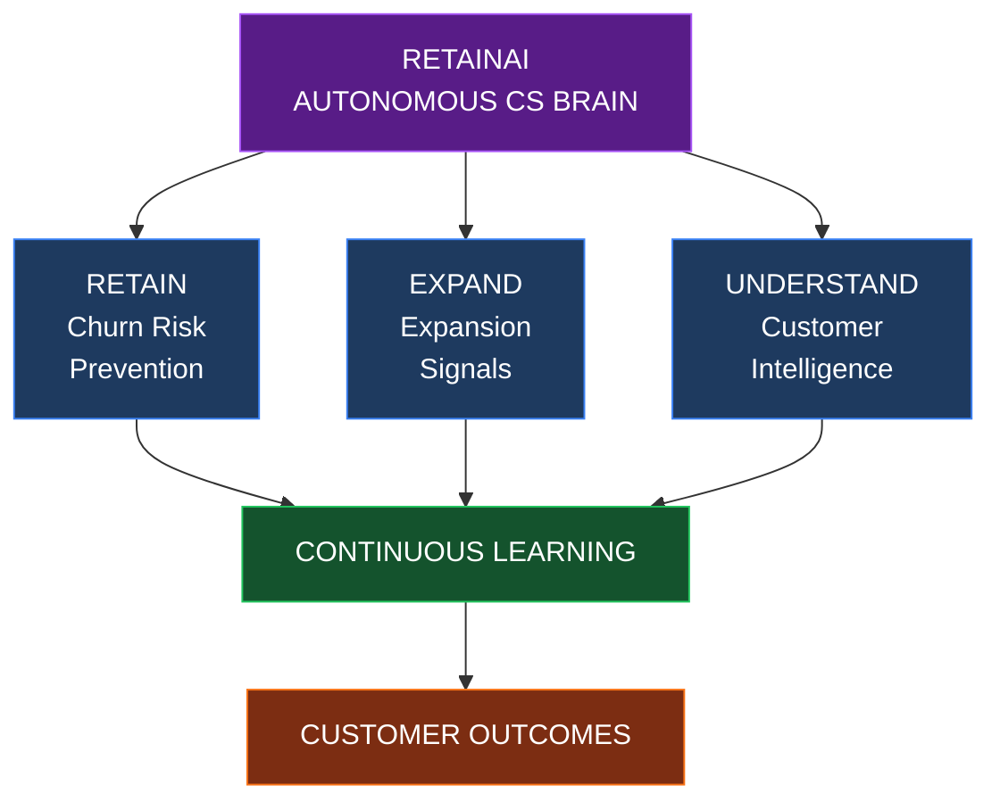
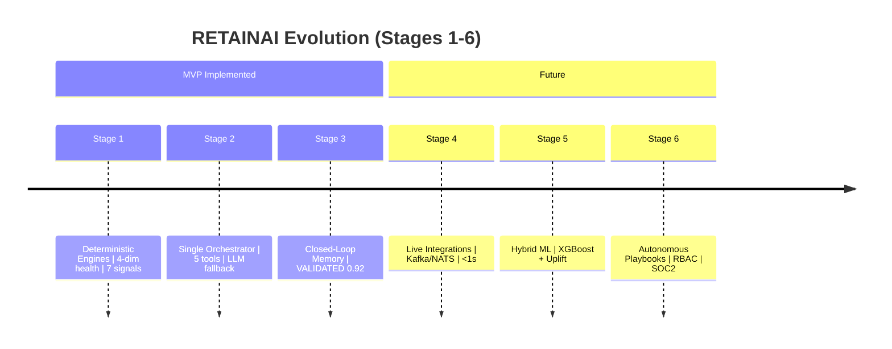

# RETAINAI -- Roadmap

> Builds on `docs/FUTURE_ROADMAP.md` (44 lines, canonical future). This doc expands with status, deliverables, tech debt, and 30/60/90 plan.

---

## 1. At a Glance -- Status Table

| Stage | Title | Status | Key Artifact |
|---|---|---|---|
| **1** | Deterministic Engine & Signal Ingestion | ✅ **MVP -- Implemented** | `engine/health_engine.py:48` 4-dim `0.4/0.3/0.2/0.1`, `engine/signal_engine.py:40` 7 signals, `engine/time_window.py:55` 7d/30d, `engine/risk_engine.py:26` thresholds 20/40/60/80/90 |
| **2** | Tool-Based Agentic Investigation & Reasoning | ✅ **MVP -- Implemented** | `agents/orchestrator.py:34` single orchestrator, 5 canonical tools `agents/tools.py:11`, `investigation_agent.py:34` + `action_agent.py:35` with deterministic fallback |
| **3** | Closed-Loop Experience Memory Bank | ✅ **MVP -- Implemented** | `engine/learning_engine.py:37` gate `health_delta>=15 -> VALIDATED`, `db/models.py:308` `ExperienceMemory`, `mem-001` seeded 0.92 |
| **4** | Live Integrations & Real-Time Event Streaming | 🔮 Future | Segment/Mixpanel/PostHog + Zendesk/Intercom + Salesforce/HubSpot + Stripe/Slack; Kafka/NATS; sub-second re-evaluations |
| **5** | Hybrid ML Predictive Risk & Uplift Modeling | 🔮 Future | XGBoost + survival analysis + causal uplift; LLM reasoning + statistical baseline |
| **6** | Autonomous Playbook Execution & Multi-Agent Delegation | 🔮 Future | Auto low-risk playbooks (Calendly), RBAC, multi-tenancy, SOC2 |

Stages 1–3 are demo-proven (see `docs/DEMO_GUIDE.md`). Stages 4–6 are `docs/FUTURE_ROADMAP.md` verbatim.

---

## 2. Stage Details

### Stage 1: Deterministic Engine & Signal Ingestion -- ✅ MVP

**Goals:** Multi-dimensional health scoring, period-over-period delta detection, structured Customer 360 data models.
**Delivered:**
- 14 tables `db/models.py:57` (customers, usage_events, support_tickets, customer_feedbacks, account_events, risk_assessments, evidences, investigation_reports, interventions, intervention_outcomes, experience_memories, agent_runs, system_event_logs, feature_adoptions) with indices `backend/src/retainai/db/models.py:404`.
- 6 repos + 5 services (`services/customer_service.py:28` `reassess_customer_risk`, `services/timeline_service.py:17`, `services/event_ingestion_service.py:17`).
- Seed `data/seed/retainai_dataset_v2.json` idempotent 101/3131/82/94 via `scripts/seed_database.py:63` `drop_all+create_all`.
- Comprehensive docs: `docs/BACKEND_GUIDE.md:810`, `docs/DATA_MODEL.md:688`, `docs/ENGINE_REFERENCE.md:675`.

**Metrics:** Deterministic health math covered by `backend/tests/test_health_and_risk.py:9`, time-window `±5%` trend `engine/time_window.py:49`.

### Stage 2: Tool-Based Agentic Investigation & Reasoning -- ✅ MVP

**Goals:** Single orchestrator with schema-validated tools for RCA synthesis, evidence grounding, personalized retention planning.
**Delivered:**
- `AgentTools` 4 deterministic tools `tools.py:40` + `InvestigationAgent`/`ActionStrategyAgent` LLM wrappers with hardcoded fallback (TICK-101/FEED-201) for demo reliability `llm_client.py:37`.
- `AgentOrchestrator.run_full_rescue_workflow` `orchestrator.py:34` -- 8-step: Profile -> Evidence -> Signals -> Investigation -> Memory -> Plan -> Persist -> Audit.
- `AgentRun` audit trail `db/models.py:374` (`RUNNING->COMPLETED/FAILED`, `tool_calls` JSON).

**Metrics:** Evidence grounding `investigation_agent.py:65` `INSUFFICIENT_EVIDENCE` when `<2` categories + health>60; tests `backend/tests/agents/test_investigation_agent.py:8`.

### Stage 3: Closed-Loop Experience Memory Bank -- ✅ MVP

**Goals:** Post-intervention 14-day outcome tracking, CSM HITL feedback, global strategy memory updates.
**Delivered:**
- Validation gate `learning_engine.py:37` `>=15 SUCCESS / >=0 NEUTRAL / else FAILURE`; `confidence 0.90` outcome, `0.92` memory.
- `reassess` hook on `POST /api/v1/events` + `POST /interventions/{id}/outcome` `api/routes.py:146`.
- HITL: `PROPOSED -> APPROVED -> EXECUTED` flow `api/routes.py:119`, `services/intervention_service.py:21`.

**Metrics:** `docs/AI_EVALUATION.md:14` 5 criteria (groundedness, false positive, calibration, actionability, schema); seed memory `mem-001` validated.

### Stage 4: Live Integrations & Real-Time Event Streaming -- 🔮 Future

**Design (from `FUTURE_ROADMAP.md:34`):**
- **Product analytics:** Segment, Mixpanel, PostHog -- stream `usage_events` natively instead of synthetic `data/seed/`.
- **Support:** Zendesk, Intercom -- sync tickets via webhook -> `SupportTicket`.
- **CRM:** Salesforce, HubSpot -- pull `account_events` (ADMIN_LOGIN, CSM_MEETING) + renewal dates.
- **Billing:** Stripe -- ARR/MRR live.
- **ChatOps:** Slack -- push `AgentRun` summaries to CSM channel.
- **Pipeline:** Kafka/NATS for sub-second `reassess_customer_risk` on every event (currently HTTP-triggered).

**Deliverables:** Connector interface `connectors/base.py`, per-source adapters, event bus abstraction, backfill CLI, latency <1s p95.

**Why not MVP:** Adds external creds, rate-limit handling, and observability beyond 2-day hackathon demo.

### Stage 5: Hybrid ML Predictive Risk & Uplift Modeling -- 🔮 Future

**Design (from `FUTURE_ROADMAP.md:38`):**
- Statistical baseline: Gradient-boosted trees (XGBoost) + survival analysis (Kaplan-Meier) trained on `risk_assessments` history to output churn probability.
- LLM layer consumes ML score *as one input* alongside evidence narrative -- LLM never does arithmetic.
- **Causal inference & uplift modeling:** Estimate heterogeneous treatment effects (which accounts respond best to *which* intervention type) using `experience_memories` with `success_count/failure_count`.
- Ensemble: `final_risk = α * ml_prob + (1-α) * deterministic_health_score_complement` with calibrated α.

**Deliverables:** Feature store (usage deltas, ticket features), model registry, SHAP explanations per risk, uplift ranking for CSM queue.

### Stage 6: Autonomous Playbook Execution & Multi-Agent Delegation -- 🔮 Future

**Design (from `FUTURE_ROADMAP.md:42`):**
- Low-risk, pre-approved playbooks execute autonomously: automated product walk-through emails, Calendly invite creation, in-app nudges -- no HITL for `confidence>=0.90` + `risk_level<=WATCH` + playbook whitelisted.
- Multi-agent delegation for enterprise scale: one `AgentRun` fans out to `RiskAgent`, `RootCauseAgent`, `ActionAgent` with handoff protocol (vs current single orchestrator) -- only when chatter cost < specialization gain.
- RBAC (`csm_name/csm_email` -> roles), multi-tenancy (`customer_id` scoping), SOC2 audit (`SystemEventLog` + `AgentRun` immutable), PII minimization.

**Deliverables:** Playbook DSL, approval matrix, delegation protocol `docs/ai/tool-contracts.md` extension, compliance docs.

---

## 3. MVP vs Future -- Comparison

| Capability | MVP (Stages 1–3) | Future (Stages 4–6) |
|---|---|---|
| **Data sources** | Synthetic `retainai_dataset_v2.json` seed 42 | Live Segment/Zendesk/Salesforce/Stripe + Kafka |
| **Health model** | 4-dim `0.4/0.3/0.2/0.1` `health_engine.py:48` | 6-dim + ML ensemble + uplift |
| **Risk signal** | 7 signals, thresholds -25%/-50% `signal_engine.py:48` | + seasonal decomposition + anomaly detection |
| **Agent topology** | Single `AgentOrchestrator` | Delegated multi-agent when justified |
| **Learning** | Gate `health_delta>=15` -> VALIDATED | + XGBoost + survival + HTE uplift ranking |
| **Execution** | HITL approval required for all external actions | Auto low-risk playbooks + RBAC |
| **Observability** | `AgentRun` + `SystemEventLog` + pytest 25 | + Prometheus + Grafana + traces + cost tracking |

---

## 4. Technical Debt & Known Gaps (Pay Before Stage 4)

| # | Gap | File | Fix |
|---|---|---|---|
| 1 | **False-positive `USAGE_CONTEXT` ignored:** `HealthEngine` never subtracts `USAGE_CONTEXT` `impact -35` so `evaluate_signals` safeguard is inert; `CustomerService.reassess` uses `evaluate_all_signals` which never emits it | `engine/health_engine.py:32` + `services/customer_service.py:28` + `engine/signal_engine.py:100` | Route `evaluate_signals(customer,…)` where customer matters; add `elif category == USAGE_CONTEXT: usage_h -= impact` (would make -35 boost health). See `docs/ENGINE_REFERENCE.md` safeguard note. |
| 2 | **CORS open:** `CORSMiddleware allow_origins=["*"]` while `.env.example` suggests configurable | `main.py:27` | Restrict to `settings.CORS_ORIGINS` when `APP_ENV=production`. |
| 3 | **VITE baked at build:** `VITE_API_BASE_URL` hardcoded in `docker-compose.yml:31` not runtime | `frontend/Dockerfile:6` + `services/api.ts:3` | Document rebuild needed; consider runtime injection via `window._env_`. |
| 4 | **Backend healthcheck missing curl:** `python:3.11-slim` lacks `curl` for `docker-compose.yml:17` `curl -f http://localhost:8000/health` | `backend/Dockerfile:1` | Add `apt-get install curl` or switch to `wget`. |
| 5 | **DATABASE_URL split:** `settings.DATABASE_URL` vs `session.py os.getenv` | `config/settings.py:29` vs `db/session.py:9` | Consolidate to `settings.DATABASE_URL`. |
| 6 | **Orphaned routes not mounted:** `api/agent.py` import bug, `customers.py` bad orderby, `experience.py` wrong field | `api/agent.py:11` etc | Fix imports or delete; document orphaned warning in `API_REFERENCE.md`. |
| 7 | **Frontend AT_RISK badge color:** renders emerald not amber/rose | `frontend/src/components/RiskBadge.tsx:11` | Add `AT_RISK` -> rose branch. |
| 8 | **No auth/RBAC:** all endpoints unauthenticated | `main.py` + `api/routes.py` | Add JWT/session before handling real PII. |
| 9 | **Reference date unused:** `SignalEngine.evaluate_signals(customer,… reference_date)` ignores param | `engine/signal_engine.py:100` | Wire to `calculate_usage_window_delta(..., reference_date)`. |
| 10 | **`job_completion_rate` unused:** column present but no engine reads it | `db/models.py:124` | Either consume for efficiency vs decay or remove column. |
| 11 | **Smoke duplicate:** `Makefile smoke` == `seed` | `Makefile:42` | Replace with `curl` sequence from `IMPLEMENTATION_PLAN.md:99`. |

---

## 5. Next 30 / 60 / 90 Days

### 30 Days -- Harden MVP for Staging

- [ ] Fix gaps 1–4 above; add regression tests (Acme end-to-end `POST /events -> reassess -> investigate -> approve -> outcome -> memory`).
- [ ] Expand `infra/README.md` from 7 -> 30 lines; fix `Makefile smoke` + add `curl` to backend image; consolidate `DATABASE_URL`.
- [ ] Add `docs/API.md` auto-generated from `http://localhost:8000/openapi.json` + merge with hand-written `API_REFERENCE.md`.
- [ ] Polish `frontend RiskBadge` + `VITE_*` runtime injection.

### 60 Days -- Integrations Spike (Stage 4 light)

- [ ] Build connector abstraction: `connectors/base.py` with `fetch_usage`, `fetch_tickets`, `fetch_feedback` contracts.
- [ ] Implement one real connector (e.g., Zendesk webhook -> `SupportTicket`) behind feature flag `DEMO_MODE=false` (`settings.py`).
- [ ] Introduce `NATS` or `Kafka` local for `POST /events` stream; keep HTTP path as fallback.

### 90 Days -- ML Prototype (Stage 5 light)

- [ ] Export `risk_assessments` + `experience_memories` to training corpus.
- [ ] Train baseline XGBoost `churn_probability` on 101-> scaled synthetic 1k; compare to deterministic `risk_level`.
- [ ] Add `ml_probability` column to `RiskAssessment` (nullable, no engine coupling yet) + SHAP summary in `InvestigationReport.recommended_action`.

---

## 6. Stage Metrics

| Stage | North-star Metric | How to Measure |
|---|---|---|
| 1 | Deterministic parity | `pytest -v` 25+ tests + `TimeWindowEngine` ±5% trend parity |
| 2 | Evidence groundedness | 100% investigations cite `evidence_ids` (`investigation_agent.py:46`) |
| 3 | Learning validation | Count `ExperienceMemory where VALIDATED` after `POST /outcome` |
| 4 | Connector freshness | Lag <1s from external event -> `reassess_customer_risk` |
| 5 | ML lift | AUC over deterministic baseline on holdout `AT_RISK/CRITICAL` slice |
| 6 | HITL reduction | % interventions auto-approved with high confidence, zero escalations |

---

## 7. How to Contribute

1. **Read before coding:** `docs/IMPLEMENTATION_PLAN.md:19` canonical table + `docs/ENGINE_REFERENCE.md` thresholds + `docs/BACKEND_GUIDE.md` pitfall table.
2. **Pick a stage 4–6 spike:** Open ADR in `docs/decisions/ADR-002-*.md` before adding a dependency.
3. **Guard demo path:** `mock_key_for_dev` path must stay green (`uv run pytest -v` + `npm run build`) -- see `docs/DEVELOPMENT_GUIDE.md` verification.
4. **Update docs alongside code:** If you touch `engine/*`, also update `docs/ENGINE_REFERENCE.md`; if you add a tool, also update `docs/ai/tool-contracts.md` + `agents/tools.py` + `docs/API_REFERENCE.md`.

---

*See `docs/FUTURE_ROADMAP.md:1` for the original 44-line future-only visual; this doc adds the implemented 1–3 context and the execution plan. Last synced 2026-08-30.*

