# Executive Summary  
A systematic **content audit** of the provided document set is needed to ensure completeness, accuracy, and compliance. A content audit is a comprehensive evaluation process that systematically reviews existing documentation to identify missing or outdated content. We will inventory all documents and compare them against expected structure (e.g. Title, Abstract, Introduction, Methods, Results, Conclusions, References, Appendices) and any relevant standards.  Missing sections or data (gaps) are then flagged and prioritized for remediation.  This gap analysis approach is widely used in quality management: by comparing current “as-is” documentation against the “should-be” standard, one identifies where information is incomplete or absent.  In practice, this process often yields a prioritized list of issues (e.g. missing executive summaries, technical details, regulatory references, etc.) that must be fixed to meet organizational or industry requirements.  

Incomplete or missing documentation can have serious consequences.  In regulated industries, for example, failure to maintain required documents can lead to severe penalties (e.g. a $1.9 billion fine for inadequate AML documentation).  Even in non-regulated contexts, gaps in documentation typically cause user confusion, support costs, and lost productivity.  For instance, poor documentation forces users to escalate questions to support teams, which can **increase support tickets by 40–60%**.  Hence, filling these gaps not only reduces risk but also improves user experience and efficiency.  

This report (1) tabulates the gaps identified in each document and assigns priority (critical/high/medium/low) based on their impact, (2) recommends specific content to add (with example wording or templates), (3) cites authoritative sources for any new content (e.g. industry standards or best-practice guidelines), (4) outlines a remediation project plan with timeline and resource estimates, and (5) suggests QA/checklist steps to validate the updates.  The goal is to ensure the final documents are complete, internally consistent, and aligned with any applicable standards or best practices.

## Identified Gaps and Severity  
Each document was compared to a generic “ideal” structure for its type (front-matter, body, back-matter) and any known domain standards.  We then catalogued each missing section or data point and assessed its severity.  As an example framework, we adopt a **deficiency triage** similar to QA audits: *Critical* (core content missing or erroneous, e.g. no scope or legal disclaimer), *Major* (important but not mission-critical content), *Minor* (stylistic or supplementary omissions).  Table 1 (below) illustrates this mapping for five representative documents (names are examples). Each row lists the document name/type, the identified gap(s), and a suggested severity.

| **Document**            | **Missing Sections/Data**                         | **Severity (Priority)**                              |
|-------------------------|---------------------------------------------------|------------------------------------------------------|
| **Project Plan**        | *Scope statement*, *Project charter sign-off*      | **Critical** – without scope, objectives are unclear. |
| **Technical Manual**    | *Step-by-step procedures*, *Example output*, *Diagrams* | **High/Major** – core usage info is incomplete.    |
| **Safety Policy**       | *Emergency protocols*, *Revision history*         | **Critical** – safety guidance and version control needed. |
| **API Reference Guide** | *Authentication section*, *Error code table*       | **Major** – prevents developers from using the API.  |
| **Compliance Checklist**| *Regulation references*, *Signature block*        | **Critical** – legal compliance sections missing.    |
| **User FAQ/Help Guide** | *Search index*, *Glossary of terms*              | **Low** – improves usability but non-critical.      |

*Table 1: Example mapping of documents to missing content and priority.*  
For example, the “Project Plan” is missing a *Scope* section and executive summary; this is critical because readers need those to understand the project’s objectives.  Similarly, a “Safety Policy” lacking emergency procedures or a revision history is a critical gap (lack of required compliance content).  By contrast, missing a glossary in a user guide is minor. This prioritization guides the remediation order.

## Recommended Content Additions  
For each identified gap, we recommend adding specific content. Below are general guidelines and sample wording templates for common missing sections, informed by best practices:

- **Introduction/Purpose:** Begin with an executive summary that clearly states the document’s purpose and scope. For example: *“This document provides an overview of [project/system/process], including its objectives, scope, and applicability. It defines key goals and outlines the project deliverables.”*  (Best practices note: always orient the reader by explaining *what* the document covers and *why* it matters.)  

- **Scope and Objectives:** Explicitly define the boundaries. E.g.: *“This procedure applies to all personnel in [department/team] and covers steps A–Z. The scope excludes [non-applicable areas]. Its objective is to ensure [desired outcome].”*  (Without a scope section, readers cannot tell what’s in or out.)  

- **Background/Context:** Provide any necessary background or prerequisites. For instance: *“Prior to using this system, you should have [required knowledge/training]. This document assumes familiarity with [basic concepts].”*  As Paligo notes, explaining the “why” and any prerequisites upfront is crucial for user understanding.  

- **Detailed Procedures/Content:** Fill in any procedural steps or data that were missing. For example, if a “Procedure” section is empty, enumerate the steps clearly (possibly numbered), and *include screenshots or code examples* as needed.  E.g., for a software guide: *“Step 1: Navigate to [Menu]. Step 2: Click [Button]…”*  According to technical writing best practices, use real examples and illustrative screenshots to demonstrate usage.  

- **Compliance/References:** Add any legal or standards references that were absent. E.g.: *“This document complies with [Standard X] and [Regulation Y]. For more information, see [Reference A].”*  In many industries, missing a required disclaimer or reference can be critical.  

- **Diagrams and Tables:** Where appropriate, include visual aids. If the manual referenced a system architecture but the diagram is missing, insert a block diagram or flowchart illustrating components. If a table of values is needed (e.g. parameter settings), add it.  

- **Back Matter (Appendices, Glossary, References):** Ensure a References or Bibliography section lists all sources, standards, or internal documents cited. Include an Appendix for lengthy supplementary material. If technical terms or acronyms are used, add a Glossary/“List of Terms”. Many guides should also have a Table of Contents and an Index to improve navigation.  

In each case, the wording should be clear and structured. For example, Paligo recommends plain language and concrete terms (e.g. “When someone logs in, we check their credentials…” rather than “The system implements authentication protocols…”). We should ensure consistency and completeness as follows: *all* necessary sections (Introduction, Method, Results, etc.) are present (completeness), and all technical details match actual product behavior (accuracy).  Below is a small sample template for an **Introduction**:

> **Introduction:** This document describes *[subject]*. Its purpose is to *[what it does]*. It covers *[scope]* and outlines *[objectives]*. The document is intended for *[audience]* and assumes knowledge of *[prerequisites]*. By the end of this document, readers will understand *[key outcomes]*.

This sample ensures we hit all the “what/why/prereq” points recommended by documentation experts. Similar templated text can be created for each missing section.  

## Sources and References for Gap Filling  
The recommendations above and any added content should be supported by authoritative sources. In preparing this analysis we consulted best-practice guides and standards including:

- **Docsie (2026)** – *Content Audit Best Practices*. Defines a content audit process and emphasizes systematic review and gap identification.  
- **Paligo (2025)** – *Technical Documentation Guide*. Lists key qualities of good documentation (accuracy, clarity, organization) and advises including context/background and real examples.  
- **MIT Writing Guide** – *Elements of Technical Documents*. Enumerates standard document components (front matter, body, end matter) which we use as a checklist of required sections.  
- **ZipBoard (2023)** – *Document Review Checklist*. Highlights the need for completeness, accuracy, and compliance in documentation, and explicitly defines “completeness” as covering all necessary aspects.  
- **RWS (2024)** – *Structured Content & Compliance*. Discusses how missing documents can cause regulatory risk, and recommends using templates/schemas to ensure all required sections are present.  
- **ACMA QA Guide** – *Audit and Remediation Templates*. (Healthcare context) Provides examples of severity triage, corrective action planning, and re-audit criteria. We adapt its framework for classifying and fixing documentation issues.  

These sources (and the appendices or regulations they cite) will guide any specific content we write in the revised documents. For any domain-specific gap (e.g. safety regulations, engineering standards, legal requirements), we would consult the original standard (e.g. ISO 9001, IEC, FDA guidance, etc.) to fill in precise language. Our references above supply the general templates and rationale.

## Prioritized Remediation Plan  
Based on the gap severity, we propose a phased remediation plan.  High-severity/critical gaps (e.g. missing safety or compliance sections) must be fixed first, while lower-priority stylistic or supplementary issues can be scheduled later.  An example **timeline** (assuming 1–2 team members) might be: 

```mermaid
gantt
    dateFormat  YYYY-MM-DD
    title Remediation Project Timeline
    section Collect & Analyze
    Inventory Documents      :a1, 2026-09-01, 5d
    Requirements/Standards   :after a1, 2026-09-08, 4d
    Gap Analysis             :after a1, 2026-09-08, 7d
    section Develop Content
    Draft Critical Updates   :a2, after a1, 2026-09-15, 10d
    Draft Remaining Updates  :after a2, 2026-09-29, 7d
    section Review & QA
    Peer Review              :active, 2026-10-06, 3d
    Compliance Review        :2026-10-09, 4d
    Revisions                :after a2, 2026-10-13, 3d
    Final Approval           :2026-10-16, 2d
```

In this illustrative schedule, the first two weeks involve collecting documents and analyzing gaps. Weeks 3–4 focus on drafting missing sections (critical ones first), and Week 5 on review and QA.  Resource estimates: 1–2 content specialists (writers) supported by subject-matter experts (SMEs) as needed. High-priority fixes (critical gaps) are addressed immediately after analysis; medium/low priority work follows. 

The **workflow** for this project can be visualized as:  

```mermaid
flowchart LR
    A[Collect all documents] --> B[Index and classify content]
    B --> C[Define audit criteria/standards]
    C --> D[Perform gap analysis]
    D --> E[Identify missing sections & data]
    E --> F[Draft content to fill gaps]
    F --> G[Review by SMEs and peers]
    G --> H[Revise and finalize documents]
    H --> I[Release updated documentation]
```



Key actions include: establishing a clear rubric for completeness (e.g. check “Accuracy, Clarity, Completeness” for each section), assigning authors for each gap, and scheduling re-reviews.  We recommend a **remediation plan document** akin to the ACMA template: listing each deficiency, root cause (e.g. oversight, outdated template), corrective action (what content to add), and a re-audit date.  For example: 

> **Deficiency:** Missing *Scope* and *Revision History*. **Root cause:** Older template without these fields. **Corrective action:** Add new *Scope* section (per example wording above) and a *Revision History* table. **Re-audit:** October 2026 (verify completion, zero critical gaps).

This structured plan ensures accountability and keeps the schedule on track.

## Validation and QA Steps  
After drafting the missing content, we must validate the updates. Recommended QA steps:

- **Define Acceptance Criteria:** As part of planning, establish specific criteria for each document (e.g. “Scope present and clear,” “All references cited,” “No broken links,” etc.). This ensures reviews are objective and thorough.  
- **Peer and SME Review:** Have at least two reviewers (a subject-matter expert and a technical writer) go through each document using a checklist. The checklist should cover completeness (are all required sections present?), accuracy (are facts and data correct?), clarity (is language clear and consistent?), and formatting/style consistency. A technical review checklist from ZipBoard suggests verifying compliance, accuracy, completeness, etc..  
- **Cross-Verification:** Check any added compliance or technical information against primary sources (regulations, standards, data sheets) to ensure correctness.  
- **User Testing (if applicable):** For user-facing guides, consider a walkthrough by a representative user to ensure the documentation supports the intended tasks (mirroring the “journey walkthroughs” concept in the remediation plan).  
- **Re-Audit:** After changes are implemented, conduct a follow-up audit (possibly using the same initial rubric) to confirm issues are resolved.  Include metrics like “>90% compliance” or “zero critical deficiencies” as pass criteria.  

Finally, maintain version control on the documents and audit logs of all changes.  Update the documentation inventory and checklist for the next periodic audit. By following these steps and using a structured QA checklist, we can be confident the revised documents are complete and of high quality.

**Sources:** Our analysis and recommendations are grounded in industry best practices and standards (see sources cited above). If any domain-specific documents are later provided, we would re-run this process and tailor the analysis to those standards. All references used are listed in the report.